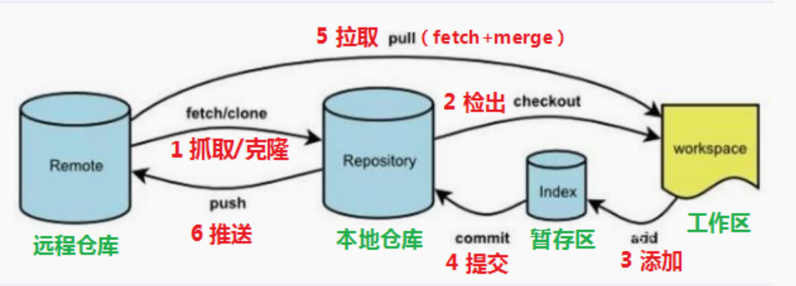
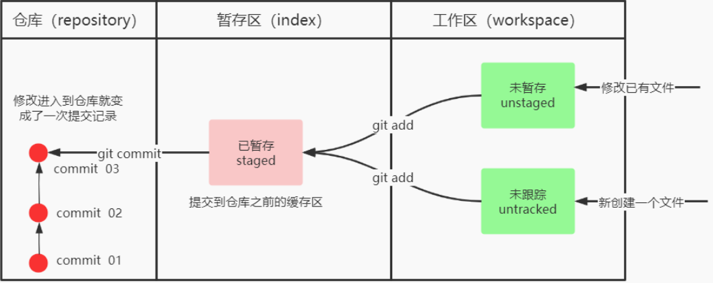
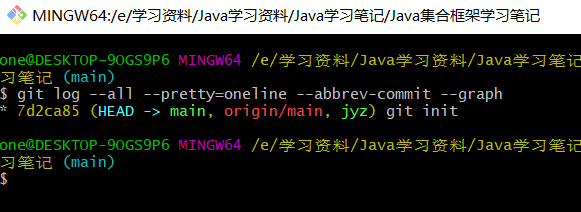

## 1、git工作流程图



命令如下：

1. clone（克隆）：从远程仓库中克隆代码到本地仓库
2. checkout（检出）：从本地仓库中检出一个仓库分支然后进行修订
3. add（添加）：在提交前先将代码提交到暂存区
4. commit（提交）：提交到本地仓库。本地仓库中保存修改的各个历史版本
5. fetch（抓取）：从远程库，抓取到本地仓库，不进行任何的合并动作，一般操作比较少。
6.  pull (拉取) ： 从远程库拉到本地库，自动进行合并(merge)，然后放到到工作区，相当于fetch+merge
7. push（推送）：修改完成后，需要和团队成员共享代码时，将代码推送到远程仓库


## 2、git常用命令


### 基本配置命令

```java
设置：
    git config --global user.name "JYZ"
    git config --global user.email "996950592@qq.com"

查看：
    git config --global user.name
    git config --global user.email
```

### 

### 创建本地仓库

打开 Git bash窗口 执行命令 `git init`


### 基本操作命令

Git工作目录下对于文件的**修改**(增加、删除、更新)会存在几个状态，这些**修改**的状态会随着我们执行Git的命令而发生变化。



- git add  单个文件名 | 通配符

  - git add .    // 将所有修改加入暂存区

- git commit （暂存区 --> 本地仓库）

  - git commit -m '注释内容'

- git status （查看修改的状态）

- git log  [option]

  - options
    - -all 显示所有分支
    - --pretty = oneline 将提交信息显示为一行
    - --abbrev-commit 使得输出的commitId更简单
    - --graph 以图的形式显示

  

- git reset --hard commitID    //上面的7d2ca85就是commitID

- git reflog  //可以查看已经删除的提交记录

**.gitignore文件的作用**  ：使一些文件无需纳入Git的管理。


### 分支

- git branch     // 查看分支
- git branch 分支名 
- git checkout 分支名   // 切换分支
- git checkout -b 分支名  //切换到一个不存在的分支（创建并交换）
- git merge 分支名  // 合并分支   （一般是在master分支下合并其他分支）
- git branch -d 分支名 //删除分支时，需要做各种检查
- git branch -D 分支名  // 不做任何检查，强制删除


## 3、Git远程仓库

**先需要在github、gitee上创建一个仓库**

### 配置SSH公钥  --- 在本地生成（用来连接本地仓库和远程仓库的钥匙）

- 生成SSH公钥
  - 执行`ssh-keygen-t rsa`命令
  - 不断回车，如果公钥存在，则自动覆盖
- 获取公钥
  - cat ~/.ssh/id_rsa.pub
- 将获取到的公钥设置在github里面，即可完成连接


### 操作远程仓库

#### 添加远程仓库

- git remote add <远端名称> <仓库路径>
  - 例如: git remote add origin git@gitee.com:czbk_zhang_meng/git_test.git

#### 查看远程仓库

- git remote 

#### 推送到远程仓库

- git push origin master

**github将主分支改成了main**需要进行以下操作：

- git branch -M main  //将本master分子更名为main分支

#### 克隆

- git clone

#### 抓取

- git pull [remote name] [branch name]  //第二次直接git pull即可

#### 推送

- git push [remote name] [branch name] //第二次直接git push即可

