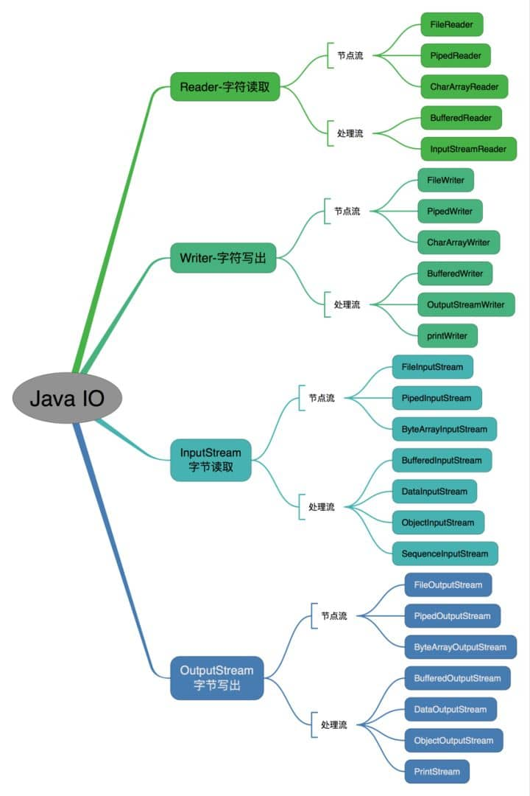

[TOC]


### JDK和JRE

- JDK 是 Java Development Kit 缩写

- JRE------Java Runtime Environment
- JDK能够创建和编译程序，JRE只能编译程序，不能创建


### 什么是字节码？采用字节码的好处是什么？

- JVM可以理解的代码就叫字节码（.class文件）


### 字符型常量和字符串常量的区别

- 字符型常量： char c = ‘a’     单引号    可以参加表达式运算（加减）
- 字符串常量：String s = "abc"  双引号  不能参加表达式运算


### 什么是可变长参数

- （String... args）   以数组的形式取用 

```java
public class VariableLengthArgument {

    public static void printVariable(String... args) {
        String[] var1 = args;
        int var2 = args.length;

        for(int var3 = 0; var3 < var2; ++var3) {
            String s = var1[var3];
            System.out.println(s);
        }

    }
    // ......
}
```


### 基本类型和包装类型的区别？

- 包装类型不赋值就是null，基本类型有默认值且不是null
- 包装类型可用于泛型，而基本类型不可以
- 基本数据类型的局部变量（在方法中定义的变量）存放在 Java 虚拟机栈中的局部变量表中，基本数据类型的成员变量（在类中定义的成员变量）（未被 `static` 修饰 ）存放在 Java 虚拟机的堆中。包装类型属于对象类型，我们知道几乎所有对象实例都存在于堆中。


### 包装类型的缓存机制

- `Byte`,`Short`,`Integer`,`Long` 这 4 种包装类默认创建了数值 **[-128，127]** 的相应类型的缓存数据
- `Character` 创建了数值在 **[0,127]** 范围的缓存数据
- `Boolean` 直接返回 `True` or `False`

**所有整型包装类对象之间值的比较，全部使用 equals 方法比较**


### 自动装箱与拆箱，原理

- 装箱：将基本类型用它们对应的引用类型包装起来  
- 原理：调用valueOf（）方法
- 拆箱：将包装类型转换为基本数据类型
- 原理：调用xxxValue（）方法


### 接口

- 接口的成员变量只能是`public static final`


### 深拷贝和浅拷贝的区别

- **浅拷贝**：浅拷贝会在堆上创建一个新的对象（区别于引用拷贝的一点），不过，如果原对象内部的属性是引用类型的话，浅拷贝会直接复制内部对象的引用地址，也就是说拷贝对象和原对象共用同一个内部对象。
- **深拷贝** ：深拷贝会完全复制整个对象，包括这个对象所包含的内部对象。


### 引用拷贝

- **引用拷贝**：两个不同的引用指向同一个对象


### final关键字

**final关键字可以修饰类、方法和变量**

- 修饰类：表明这个类不能被继承
- 修饰方法：表明任何继承类都不能修改此方法
- 修饰变量
  - 修饰基本数据类型的变量：初始化后就不能修改
  - 修饰引用类型的变量：初始化后就不能让其指向另一个对象

- static和final区别：static作用于成员变量表示只保存一份副本，final用于保证变量不可变


### Object类

```java
/**
 * native 方法，用于返回当前运行时对象的 Class 对象，使用了 final 关键字修饰，故不允许子类重写。
 */
public final native Class<?> getClass()
/**
 * native 方法，用于返回对象的哈希码，主要使用在哈希表中，比如 JDK 中的HashMap。
 */
public native int hashCode()
/**
 * 用于比较 2 个对象的内存地址是否相等，String 类对该方法进行了重写以用于比较字符串的值是否相等。
 */
public boolean equals(Object obj)
/**
 * naitive 方法，用于创建并返回当前对象的一份拷贝。
 */
protected native Object clone() throws CloneNotSupportedException
/**
 * 返回类的名字实例的哈希码的 16 进制的字符串。建议 Object 所有的子类都重写这个方法。
 */
public String toString()
/**
 * native 方法，并且不能重写。唤醒一个在此对象监视器上等待的线程(监视器相当于就是锁的概念)。如果有多个线程在等待只会任意唤醒一个。
 */
public final native void notify()
/**
 * native 方法，并且不能重写。跟 notify 一样，唯一的区别就是会唤醒在此对象监视器上等待的所有线程，而不是一个线程。
 */
public final native void notifyAll()
/**
 * native方法，并且不能重写。暂停线程的执行。注意：sleep 方法没有释放锁，而 wait 方法释放了锁 ，timeout 是等待时间。
 */
public final native void wait(long timeout) throws InterruptedException
/**
 * 多了 nanos 参数，这个参数表示额外时间（以毫微秒为单位，范围是 0-999999）。 所以超时的时间还需要加上 nanos 毫秒。。
 */
public final void wait(long timeout, int nanos) throws InterruptedException
/**
 * 跟之前的2个wait方法一样，只不过该方法一直等待，没有超时时间这个概念
 */
public final void wait() throws InterruptedException
/**
 * 实例被垃圾回收器回收的时候触发的操作
 */
protected void finalize() throws Throwable { }
```


### == 与 equals（）的区别


**==对于基本类型和引用类型的作用效果是不同的**

- 对于基本数据类型来说，==比较的是值
- 对于引用类型来说，==比较的是对象的内存地址


**equals（）不能用于判断基本数据类型的变量，只能用来判断两个对象是否相等**

equals（）方法存在于Object类中，所以所有的类都有equals（）方法

```java
public boolean equals(Object obj) {
     return (this == obj);
}
```

`equals()` 方法存在两种使用情况：

- **类没有重写 `equals()`方法** ：通过`equals()`比较该类的两个对象时，等价于通过“==”比较这两个对象，使用的默认是 `Object`类`equals()`方法。**也就是说比较对象的内存地址**
- **类重写了 `equals()`方法** ：一般我们都重写 `equals()`方法来比较两个对象中的属性是否相等；若它们的属性相等，则返回 true(即，认为这两个对象相等)。


### hashCode()有什么用

- 作用------->获取哈希码--------->确定该对象在哈希表中的索引位置
- 实现：该方法通常用来将对象的内存地址转换为整数之后返回

- 对象在加入HashSet时，先用hashCode判断加入的位置，如果位置一样，则再用equals判断是否相同
- 如果两个对象的`hashCode` 值相等，那这两个对象不一定相等（哈希碰撞）
- 如果两个对象的`hashCode` 值相等并且`equals()`方法也返回 `true`，我们才认为这两个对象相等。
- 如果两个对象的`hashCode` 值不相等，我们就可以直接认为这两个对象不相等。


### String类

#### String、StringBuffer、StringBuilder 的区别？

**可变性**

- String不可变
- **StringBuffer**和**StringBuilder**都继承于**AbstractStringBuilder**，故这两个都是可变的


**线程安全性**

- String线程安全
- StringBuffer对方法加了同步锁，线程安全
- StringBuilder线程不安全


**三者总结**

- 操作少量的数据: 适用 `String`
- 单线程操作字符串缓冲区下操作大量数据: 适用 `StringBuilder`
- 多线程操作字符串缓冲区下操作大量数据: 适用 `StringBuffer`


#### String为什么是不可变的

- **因为String类中使用final关键字来修饰字符数组**


#### 字符串拼接用“+” 还是 StringBuilder?

- “+” 其实就是调用StringBuilder对象来实现的，并且每加一次就会创建一个StringBuilder对象


#### 字符串常量池的作用了解吗？

- JVM为了提升性能和减少内存对字符串（String类）专门开辟的一块区域
- 在堆中创建字符串对象“ab”，并将“ab”的引用保存在字符串常量池中，后续要用“ab”，直接返回其引用


#### String s1 = new String("abc");这句话创建了几个字符串对象？

- **会创建 1 或 2 个字符串对象**

如果字符串常量池中不存在字符串对象“abc”的引用，那么会在堆中创建 2 个字符串对象“abc”。


####  intern 方法有什么作用?

`String.intern()` 是一个 native（本地）方法，其作用是将指定的字符串对象的引用保存在字符串常量池中，可以简单分为两种情况：

- 如果字符串常量池中保存了对应的字符串对象的引用，就直接返回该引用。
- 如果字符串常量池中没有保存了对应的字符串对象的引用，那就在常量池中创建一个指向该字符串对象的引用并返回。


### 异常

#### **Java 异常类层次结构图概览** ：


- Exception：程序本身可以处理的异常，可以通过catch捕获
  - **Checked Exception** 即 受检查异常：不用catch捕获程序就不能编译
  - **Unchecked Exception** 即 **不受检查异常**：不捕获程序也可以正常编译
- Error：程序无法处理的错误，不建议通过catch捕获


### 泛型

- **泛型类**：public class Generi<T> {}
- **泛型接口**：public interface Generator<T> {}
- **泛型方法**


### I/O

#### 序列化和反序列化

- 序列化：将数据结构或对象转换成二进制字节流的过程
- 反序列化：将在序列化过程中所生成的二进制字节流转换为数据结构或者对象
- 对于不想进行序列化的变量，使用 `transient` 关键字修饰。


###  Java 中 IO 流分为几种?

- 按照流的流向分，可以分为输入流和输出流；
- 按照操作单元划分，可以划分为字节流和字符流；
- 按照流的角色划分为节点流和处理流。

1. InputStream/Reader: 所有的输入流的基类，前者是字节输入流，后者是字符输入流。
2. OutputStream/Writer: 所有输出流的基类，前者是字节输出流，后者是字符输出流。



## 重要知识点

### 


