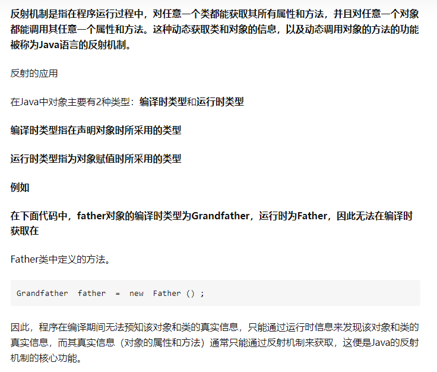

[TOC]

# Java注解与反射

## 1、注解

### 1.1、什么是注解

可以把注解理解为代码里的特殊 标记

作用：

- 不是程序本身，可以对程序作出解释
- 可以在程序编译，类加载，运行时被读取，并执行相应的处理


### 1.2、内置注解

1. 限定父类重写方法：@Override
2. 标志已过时：@Deprecated
3. 抑制编译器警告：@SuppressWarnings


### 1.3、自定义注解和元注解

**定义注解：**

1. 第一步，用@interface定义注解

   ```java
   public @interface Report {}
   ```

2. 第二步，添加参数、默认值，如果没有默认值就必须给参数赋值

   ```java
   public @interface Report {
           // 参数类型 + 参数名（）
           int type（） default 0;
           String level() default "info";
           String value() default "万里"
   }
   ```

3. 第三步，用元注解配置注解：

   ```java
   @Target(ElementType.TYPE)
   @Retention(RetentionPolicy.RUNTIME)
   public @interface Report {
       int type() default 0;
       String level() default "info";
       String value() default "";
   }
   ```

**元注解：**

- 作用：负责注解其他注解
- 总共有4个标准的元注解类型
  - @Target：用于描述注解的使用范围
    - 类或接口：`ElementType.TYPE`；
    - 字段：`ElementType.FIELD`；
    - 方法：`ElementType.METHOD`；
    - 构造方法：`ElementType.CONSTRUCTOR`；
    - 方法参数：`ElementType.PARAMETER`。
  - @Retention：表示需要在什么级别保存该注释信息，用于描述注解的生命周期
    - 仅编译期：`RetentionPolicy.SOURCE`；
    - 仅class文件：`RetentionPolicy.CLASS`；
    - 运行期：`RetentionPolicy.RUNTIME`。
    - 范围：RUNTIME>CLASS>SOURCE
  - @Document：说明该注将被包含在javadoc中
  - @Iherited：使用@Inherited定义子类是否可继承父类定义Annotation。


## 2、反射

### 1、反射和反射机制

**Java的反射是指程序在运行期可以拿到一个对象的所有信息**




### 2、Class类

java.lang.Class类，实现反射的核心类

- Class类只能由系统建立对象
- 一个加载的类在内存(JVM)中只有一个Class对象
- 一个类被加载后，类的整个结构都会被封装在Class对象中
- 每个类的实例都会记得自己是由哪个Class实例所生成
- Class类是反射的根源，针对任何你想动态加载，运行的类，唯有获得相应的Class对象

**获取Class类实例的五种方式**

```java
Class c1 = Class.forName("com.cheng.reflectuion.User");
Class c2 = user.getClass();
Class c3 = User.class;
Class<Integer> c4 = Integer.TYPE;
Class c5 = c1.getSuperclass();
```


**Class类的常用方法**

|                方法名                |                          功能说明                           |
| :----------------------------------: | :---------------------------------------------------------: |
|   static ClssforName(String name)    |                 返回指定类名namedeClass对象                 |
|         Obiect newInstance()         |          调用无参构造函数，返回Class对象的一个实例          |
|              getName()               | 返回此Class对象所表示的实体（类，接口，数组类或void）的名称 |
|        Class getSuperclass()         |             返回当前Class对象的父类的Class对象              |
|       Class[] getinterfaces()        |                   返回当前Class对象的接口                   |
|     ClassLoader getClassLoader()     |                     返回该类的类加载器                      |
| Method getMethod(name,String .class) |     返回对象Method一个数组，此对象的形参类型为paramType     |
|      Field getDeclaredFields()       |                返回对象的Field(属性)一个数组                |
|   Constructor[] getConstructors()    |       返回一个包含某些Constructor（构造器）对象的数组       |


## 3、类加载理解

- 加载：将class字节码文件内容加载到内存中，并将这些数据换成方法区的运行时数据结构，然后生成一个代表这个类的java.lang.Class对象
- 链接：将Java类的二进制代码合并到JVM的运行状态之中的过程
  - 验证：确保加载的类信息符合JVM规范，没有安全方面的问题
  - 准备：正式为类变量(static)分配内存并设置类变量默认初试值的阶段，这些内存都将在方法中去进行分配
  - 解析：虚拟机常用池内的符号引用（常量名）替换成直接引用（地址）的过程
- 初始化：
  - 执行类构造器`<clinit>()`方法的过程。类构造器`<clinit>()`方法是由编译器自动收集类中所有类变量的赋值动作和静态代码块中的语句合并产生的。（类构造器是构造类信息的，不是构造该类对象的构造器）。
  - 当初始化一个类的时候，如果发现其父类还没有进行初始化，则需要先触发其父类的初始化。
  - 虚拟机会保证一个类的在多线程环境中被正确加锁和同步。

**什么时候会发生类初始化**

- 类的主动引用（一定会发生类初始化）
  - 当虚拟机启动，先初始化main方法所在的类
  - new一个类的对象
  - 调用类的静态成员（处理final常量）和静态方法
  - 使用java.lang.reflect包的方法对类进行反射调用
  - 当初始化一个类的时候，如果发现其父类还没有进行初始化，则先初始化其父类
- 类的被动引用
  - 当访问一个静态域时，只有真正声明这个域的类才会被初始化。如：当通过子类引用父类的静态变量，不会导致子类初始化
  - 通过数组定义类引用，不会发生类初始化
  - 引用常量不会触发此类的初始化（常量在链接阶段就存入调用类的常量池中了）


## 4、类加载器

**类加载器**：完成类的加载

**类加载器的作用**：将class字节码文件内容加载到内存中，并将这些数据转换成方法区的运行时数据结构，然后生成一个代表这个类的java.lang.Class对象，作为方法区中类数据的访问入口

**JVM三种预定义类型类加载器**，当JVM启动时，Java开始使用如下三种类型的加载器：

- 根/启动（Bootstrap）类加载器：根类加载器是用本地代码实现的类加载器，它负责将JAVA_HOME/lib下面的核心类库或-Xbootclasspath选项指定的jar包等虚拟机识别的类库加载到内存中。由于根类加载器涉及到虚拟机本地实现细节，开发者无法直接获取到根类加载器的引用。
- 扩展（Extension）类加载器：扩展类加载器是由Sun的ExtClassLoader（sun.misc.Launcher$ExtClassLoader）实现的，它负责将JAVA_HOME /lib/ext或者由系统变量-Djava.ext.dir指定位置中的类库加载到内存中。开发者可以直接使用标准扩展类加载器。
- 系统（System）类加载器：系统类加载器是由 Sun 的 AppClassLoader（sun.misc.Launcher$AppClassLoader）实现的，它负责将用户类路径(java -classpath或-Djava.class.path变量所指的目录，即当前类所在路径及其引用的第三方类库的路径，下的类库加载到内存中。开发者可以直接使用系统类加载器。
  


## 5、通过反射动态的创建对象

**通过构造器创建对象**

```java
Class c1 = class.forName("com.cheng.User");
Constructor constructor = c1.getDeclaredConstructor(String.class,int.class,int.class);
User user = (User)constructor.newInstance("万里",1，18)；
```


**通过指定方法**

```java
Class c1 = class.forName("com.cheng.User");
User user = (User)c1.newInstance();
Method setName = c1.getDeclaredMethod("setName",String.class);
setName.invoke(user,"万里");
```


## 6、反射操作注解

```java
package com.cheng.reflection;
import java.lang.annotation.*;
import java.lang.reflect.Field;

//练习反射操作注解
public class Test {
    
    public static void main(String[] args) throws ClassNotFoundException, NoSuchFieldException {
        Class c1 = Class.forName("com.cheng.reflection.student2");

        //1.通过反射获得注解
        Annotation[] annotations = c1.getAnnotations();
        for (Annotation annotation : annotations) {
            System.out.println(annotation);
        }

        //2.获得注解的value值
        Cheng cheng = (cheng) c1.getAnnotation(cheng.class);
        System.out.println(cheng.value());

        //3.获得类指定字段的注解
        Field f = c1.getDeclaredField("id");
        Fieldhaha annotation = f.getAnnot ation(Fieldcheng.class);
        System.out.println(annotation.columnName());
        System.out.println(annotation.length());
        System.out.println(annotation.type());
    }
}

@Cheng("db_student")
class student2{
    @Fieldcheng(columnName = "db_id",type = "int",length = 10)
    private int id;
    @Fieldcheng(columnName = "db_age",type = "int",length = 10)
    private int age;
    @Fieldcheng(columnName = "db_name",type = "varchar",length = 3)
    private String name;
  
@Target(ElementType.TYPE)
@Retention(RetentionPolicy.RUNTIME)
@interface cheng{
    String value();
}

//定义注解
@Target(ElementType.FIELD)
@Retention(RetentionPolicy.RUNTIME)
@interface Fieldcheng{
    String columnName();
    String type();
    int length();
}   
        
    public student2() {
    }
    public student2(int id, int age, String name) {
        this.id = id;
        this.age = age;
        this.name = name;
    }

    public int getId() {
        return id;
    }

    public void setId(int id) {
        this.id = id;
    }

    public int getAge() {
        return age;
    }

    public void setAge(int age) {
        this.age = age;
    }

    public String getName() {
        return name;
    }

    public void setName(String name) {
        this.name = name;
    }

    @Override
    public String toString() {
        return "student2{" +
                "id=" + id +
                ", age=" + age +
                ", name='" + name + '\'' +
                '}';
    }
}

```

