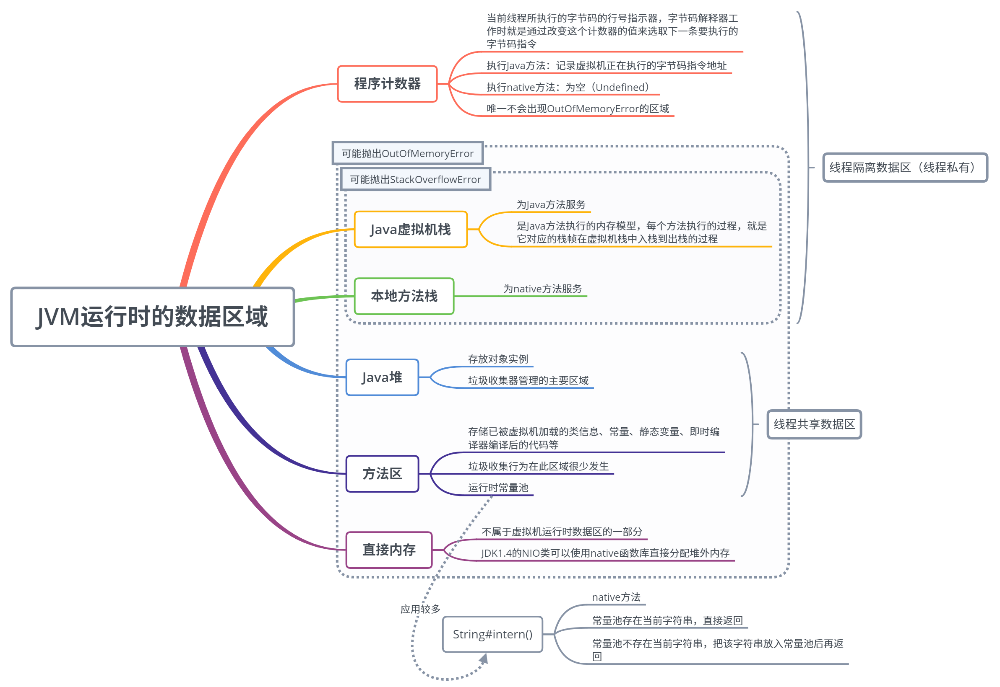

# 内存结构

### 程序计数器（寄存器）

- 作用，是记住下一条jvm指令的执行地址

- 特点

  -  是线程私有的

  - 不会存在内存溢出

    

### 虚拟机栈

- 定义：Java Virtual Machine Stacks

  -  每个线程运行时所需要的内存，称为虚拟机栈

  - 每个栈由多个栈帧（Frame）组成，对应着每次方法调用时所占用的内存

  - 每个线程只能有一个活动栈帧，对应着当前正在执行的那个方法

    

- 问题辨析

  1. 垃圾回收是否涉及栈内存？

     - 不涉及

  2. 栈内存分配越大越好吗？

     - 不是，栈内存分配过大的话，那线程数就会变少

  3. 方法内的局部变量是否线程安全？

     - 如果方法内局部变量没有逃离方法的作用访问，它是线程安全的

     - 如果局部变量引用了对象，并逃离方法的作用范围，需要考虑线程安全

       

- 栈内存溢出
  -  栈帧过多导致栈内存溢出
  - 栈帧过大导致栈内存溢出

### 本地方法栈

- 服务于native方法

- 可能抛出的异常：与Java虚拟机一样

  

### 堆

- 定义与特点

  -  通过new关键字，创建对象都会使用堆内存
  - 它是线程共享的，堆中对象都需要考虑线程安全问题
  - 有垃圾回收机制

  

### 方法区

- 存储已被虚拟机加载的类信息、常量、静态变量、即时编译器编译后的代码等数据

  - 类信息：即Class类，如类名、访问修饰符、常量池、字段描述、方法描述等

- 垃圾收集行为在此区域很少发生

- 运行时常量池也是方法区的一部分

  - 常量池，就是一张表，虚拟机指令根据这张常量表找到要执行的类名、方法名、参数类型、字面量等信息
  - 运行时常量池，常量池是*.class文件中的，当该类被加载，它的常量池信息就会被放入运行时常量池，并把里面的符号地址变为真是地址

- 可能抛出的异常

  - OutOfMemoryError（方法区无法满足内存分配需求时）

    

### 直接内存

- JDK 1.4 的 NIO 类可以使用 native 函数库直接分配堆外内存，这是一种基于通道与缓冲区的 I/O 方式，它在 Java 堆中存储一个 DirectByteBuffer 对象作为堆外内存的引用，这样就可以对堆外内存进行操作了。因为可以避免 Java 堆和 Native 堆之间来回复制数据，在一些场景可以带来显著的性能提高。
  - 常见于NIO操作，用于数据缓冲区
  - 分配成本较高，但读写性能高
  - 不受JVM内存回收管理

- 分配和回收原理

  - 使用了 Unsafe 对象完成直接内存的分配回收，并且回收需要主动调用 freeMemory 方法

  - ByteBuffffer 的实现类内部，使用了 Cleaner （虚引用）来监测 ByteBuffffer 对象，一旦

    ByteBuffffer 对象被垃圾回收，那么就会由 ReferenceHandler 线程通过 Cleaner 的 clean 方法调

    用 freeMemory 来释放直接内存

