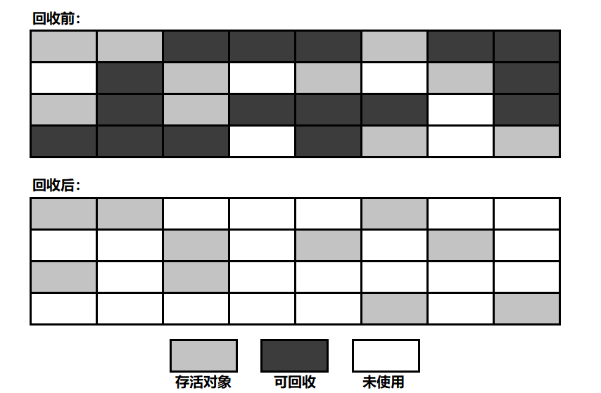

垃圾回收，它的任务是解决一下3件问题：

- **哪些内存需要回收？**

- **什么时候回收？**

- **如何回收？**

  

### 如何判断对象可以回收

#### 引用计数法

- **算法描述**
  
  -  给对象添加一个引用计数器
  - 每有一个地方引用它，计数器加1
  - 引用失效时，计数器减1
  - 计数器值为0的对象不再可用
  
- **缺点**

  

  - 很难解决循环引用问题

​			

#### 可达性分析算法（主流）

- **算法描述**
  - 从"GC ROOT"对象作为起点开始向下搜索，走过的路径称为引用链（Reference  Chain）
  - 从"GC ROOT"开始，不可达的对象被判为不可用
- **Java中可作为“GC ROOT”的对象**
  - 栈中（本地变量表中的reference）
    - 虚拟机栈中，栈帧中的本地变量表引用的对象
    - 本地方法栈中，JNI引用的对象（native方法）
  - 方法区中
    - 类的静态属性引用的对象
    - 常量引用的对象

即便如此，一个对象也不是一旦被判为不可达，就立即死去的，宣告一个的死亡需要经过两次标记过程。

### 四种引用类型

- **强引用**：像`Object obj =  new Object()` 这种，只要强引用还存在，垃圾收集器就永远不会回收掉被引用的对象
- **软引用**：用来引用还存在但非必须的。对于软引用对象，在OOM前，虚拟机会把这些对象列入回收范围中进行第二次回收，如果这次回收后，内存还不够用，就OOM，实现类：`SoftReference`

- **弱引用**：被弱引用的对象只能生存到下一次垃圾回收前，一旦发生垃圾回收，被弱引用所引用的对象就会被清理掉，实现类：`WeakReference`

- **虚引用**：幽灵引用，对对象没有半毛钱影响，甚至不能用来取得一个对象的实例。它唯一的用途就是：当被一个虚引用引用的对象被回收时，系统会收到这个对象被回收的通知，实现类：`PhantomReference`

### 垃圾回收算法

#### 基础：标记-清除算法

- **算法描述**：
  - 先标记出所有需要回收的对象（途中深色区域）
  - 标记完后，统一回收所有被标记对象
- **不足**：
  - 效率问题：标记和清除两个过程的效率都不高
  - 空间碎片问题：标记清除后会产生大量不连续的内存碎片，导致以后为较大的对象分配内存时找不到足够的连续内存，会提前触发另一次GC

#### 解决效率问题：复制算法

- **算法描述**
  - 将可用内存分为大小相等的两块，每次只使用其中的一块
  - 当一块内存用完时，将这块内存上还存活的对象复制到另一块内存上去，将这一块内存全部清理掉
- **不足**：可用内存缩小为原来的一半，适合GC过后只有少量对象存活的新手代
- **节约内存的方法**：
  - 新生代中的对象98%都是朝生夕死的，所以不需要按照1：1的比例对内存进行划分
  - 把内存划分为：
    - 1块较大的Eden区
    - 2块较小的Survivor区
  - 每次使用Eden区和1块Survivor区
  - 回收时，将以上2部分区域中的存活对象复制到另一块Survivor区中，然后将以上两部分区域请空
  - JVM参数设置：`-XX:SurvivorRatio=8` 表示 `Eden 区大小 / 1 块 Survivor 区大小 = 8`

#### 解决空间碎片问题：标记-整理算法

- **算法描述**：
  - 标记方法与“标记-清除算法”一样
  - 标记完后，所有存活对象向一端移动，然后直接清理掉边界以外的内存
- **不足**：存在效率问题，适合老年代

#### 进化：分代收集算法

- **新生代**：GC过后只有少量对象存活------**复制算法**

- **老年代**：GC过后对象存活率较高--------**标记-整理算法**

  

> 

1. 对象首先分配在伊甸园区域
2. 新生代空间不足时，触发 minor gc，伊甸园和from存活对象使用 copy 复制到 to 中，存活对象年龄加1并且交换 from to
3. minor gc 会引发 stop the world，暂停其他用户的线程，等 垃圾回收结束，用户线程才恢复运行
4. 当对象寿命超过阈值时，会晋升至老年代，最大寿命是15
5. 当老年代空间不足时，会先尝试触发 minor gc，如果之后空间仍不足，那么触发 full gc，STW的时间更长

### 垃圾回收器

1. 串行
   - 单线程
   - 堆内存较小，适合个人电脑
2. 吞吐量优先
   - 多线程
   - 堆内存较大，多核cpu
   - 让单位时间内，STW的时间最短
3. 响应时间优先
   - 多线程
   - 堆内存较大，多核cpu
   - 尽可能让单次STW的时间最短

#### 串行

#### 吞吐量优先

#### 响应时间优先（CMS）

#### G1

**适用场景**

- 同时注重吞吐量和低延迟，默认的暂停目标是200ms

- 超大堆内存，会将堆划分为多个大小相等的**Region**

- 整体上是**标记+整理**算法，两个区域之间是**复制**算法

  

##### G1垃圾回收阶段

##### Young Collection

- 会STW
- 每个区域都可以作为伊甸园（E）、survivor区(S)、老年代(O)

- 新生代垃圾回收会把伊甸园区的幸存对象已**复制**的算法复制到幸存区

- 再工作一段时间，幸存的对象比较多的时候，幸存区的对象有一部分会进入老年代

##### Young Collection + CM

- 在Young GC时会进行GC Root的初始标记

- 在老年代占用堆空间比例到达阈值时，会进行并发标记（不会STW）

  

##### Mixed Collection

会对E、S、O进行全面垃圾回收

- 最终标记（Remark）会STW
- 拷贝存活（Evacuation）会STW

拷贝没存活下来的就被垃圾回收了

