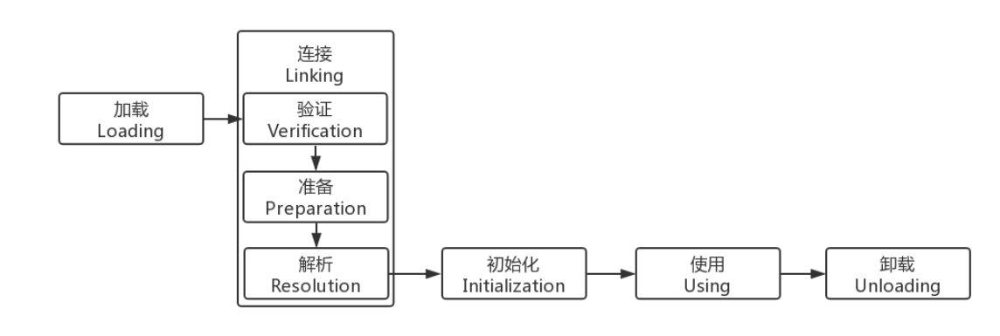
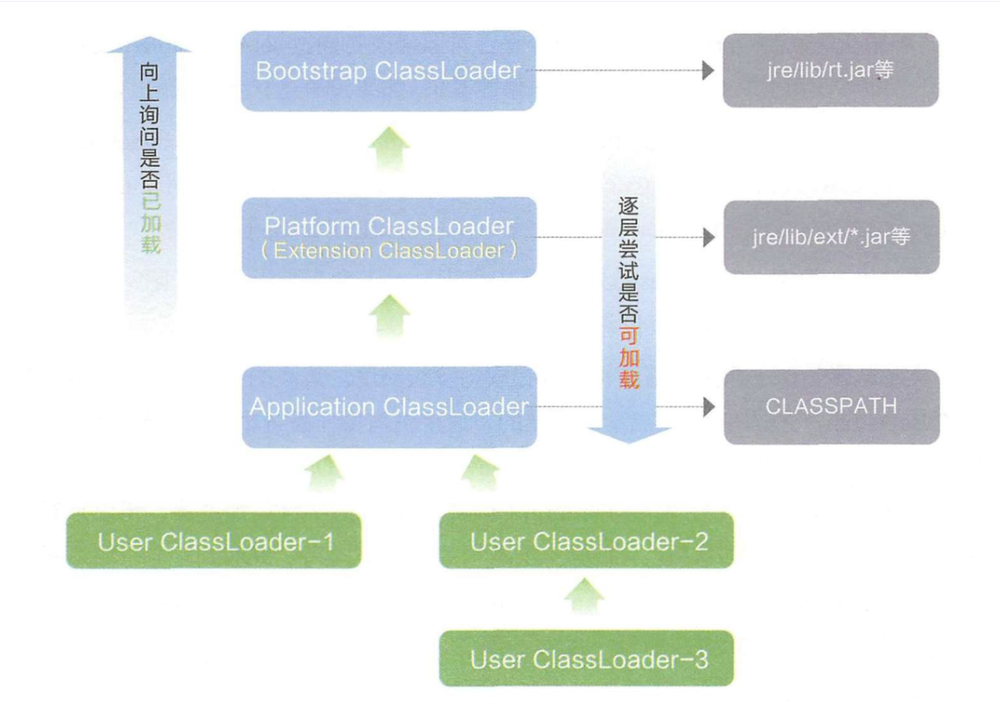

### Java虚拟机类加载机制

虚拟机把描述类的数据从Class文件加载到内存，并对数据进行校验、转换解析和初始化，最终形成可以被虚拟机直接使用的Java类型，这就是虚拟机的类加载机制。

在Java语言里面，类的加载、连接和初始化过程都是在程序运行期间完成的。

#### 类加载的过程



为支持运行时绑定，解析过程在某些情况下可在初始化之后再开始，除解析过程外的其他加载过程必须按照如图顺序开始。

##### 加载

- 通过全限定类名来获取定义此类的二进制字节流。
- 将这个字节流所代表的静态存储结构转化为方法区的运行时数据结构。
- 在内存中生成一个代表这个类的 java.lang.Class 对象，作为方法区这个类的各种数据的访问入口。

##### 验证

验证是连接阶段的第一步，这一阶段的目的是为了确保 Class 文件的字节流中包含的信息符合当前虚拟机的要求，并且不会危害虚拟机自身的安全。

##### 准备

为**类变量**分配内存并设置类变量初始值，这些变量所使用的内存都将在方法区中进行分配。

##### 解析

虚拟机将常量池内的符号引用替换为直接引用的过程。

##### 初始化

到初始化阶段，才真正开始执行类中定义的 Java 程序代码，此阶段是执行 `<clinit>()` 方法的过程。

`<clinit>()` 方法是由编译器按语句在源文件中出现的顺序，依次自动收集类中的所有**类变量**的赋值动作和静态代码块中的语句合并产生的。（不包括构造器中的语句。构造器是初始化对象的，类加载完成后，创建对象时候将调用的 `<init>()` 方法来初始化对象）

`<clinit>()` 不需要显式调用父类（接口除外，接口不需要调用父接口的初始化方法，只有使用到父接口中的静态变量时才需要调用）的初始化方法 `<clinit>()`，虚拟机会保证在子类的 `<clinit>()` 方法执行之前，父类的 `<clinit>()` 方法已经执行完毕，也就意味着父类中定义的静态语句块要优先于子类的变量赋值操作。

`<clinit>()` 方法对于类或接口来说并不是必需的，如果一个类中没有静态语句块，也没有对变量的赋值操作，那么编译器可以不为这个类生成 `<clinit>()` 方法。

虚拟机会保证一个类的 `<clinit>()` 方法在多线程环境中被正确地加锁、同步，如果多个线程同时去初始化一个类，那么只会有一个线程去执行这个类的 `<clinit>()` 方法，其他线程都需要阻塞等待，直到活动线程执行 `<clinit>()` 方法完毕。

##### 类加载的时机

对于初始化阶段，虚拟机规范规定了有且只有 5 种情况必须立即对类进行“初始化”（而加载、验证、准备自然需要在此之前开始）：

1. 遇到new、getstatic 和 putstatic 或 invokestatic 这4条字节码指令时，如果类没有进行过初始化，则需要先触发其初始化。对应场景是：使用 new 实例化对象、读取或设置一个类的静态字段（被 final 修饰、已在编译期把结果放入常量池的静态字段除外）、以及调用一个类的静态方法。
2. 对类进行反射调用的时候，如果类没有进行过初始化，则需要先触发其初始化。
3. 当初始化类的父类还没有进行过初始化，则需要先触发其父类的初始化。（而一个接口在初始化时，并不要求其父接口全部都完成了初始化）
4. 虚拟机启动时，用户需要指定一个要执行的主类（包含 main() 方法的那个类），
   虚拟机会先初始化这个主类。
5. 当使用 JDK 1.7 的动态语言支持时，如果一个 java.lang.invoke.MethodHandle 实例最后的解析结果 REF_getStatic、REF_putStatic、REF_invokeStatic 的方法句柄，并且这个方法句柄所对应的类没有进行过初始化，则需要先触发其初始化。

##### 类加载器

把实现类加载阶段中的“通过一个类的全限定名来获取描述此类的二进制字节流”这个动作的代码模块称为“类加载器”。

将 class 文件二进制数据放入方法区内，然后在堆内（heap）创建一个 java.lang.Class 对象，Class 对象封装了类在方法区内的数据结构，并且向开发者提供了访问方法区内的数据结构的接口。

##### 类的唯一性和类加载器

对于任意一个类，都需要由加载它的类加载器和这个类本身一同确立其在Java虚拟机中的唯一性。

即使两个类来源于同一个 Class 文件，被同一个虚拟机加载，只要加载它们的类加载器不同，那这两个类也不相等。这里所指的“相等”，包括代表类的 Class 对象的 equals() 方法、 isAssignableFrom() 方法、isInstance() 方法的返回结果，也包括使用 instanceof 关键字做对象所属关系判定等情况。

#### 双亲委派模型

如果一个类加载器收到了类加载的请求，它首先不会自己去尝试加载这个类，而是把这个请求委派给父类加载器去完成，每一个层次的类加载器都是如此，因此所有的加载请求最终都应该传送到顶层的启动类加载器中，只有当父加载器反馈自己无法完成这个加载请求（它的搜索范围中没有找到所需的类）时，子加载器才会尝试自己去加载。



这里类加载器之间的父子关系一般不会以继承（Inheritance）的关系来实现，而是都使用组合（Composition）关系来复用父加载器的代码。

Bootstrap 类加载器是用 C++ 实现的，是虚拟机自身的一部分，如果获取它的对象，将会返回 null；扩展类加载器和应用类加载器是独立于虚拟机外部，为 Java 语言实现的，均继承自抽象类 java.lang.ClassLoader ，开发者可直接使用这两个类加载器。

Application 类加载器对象可以由 `ClassLoader.getSystemClassLoader()` 方法的返回，所以一般也称它为系统类加载器。它负责加载用户类路径（ClassPath）上所指定的类库，如果应用程序中没有自定义过自己的类加载器，一般情况下这个就是程序中默认的类加载器。

双亲委派模型对于保证 Java 程序的稳定运作很重要，例如类 `java.lang.Object`，它存放在 rt.jar 之中，无论哪一个类加载器要加载这个类，最终都是委派给处于模型最顶端的启动类加载器进行加载，因此 Object 类在程序的各种类加载器环境中都是同一个类。

双亲委派模型的加载类逻辑可参考如下代码：

```java
    // 代码摘自《深入理解Java虚拟机》
    protected synchronized Class<?> loadClass(String name, boolean resolve) throws ClassNotFoundException {
        // 首先，检查请求的类是否已经被加载过了
        Class c = findLoadedClass(name);
        if (c == null) {
            try {
                if (parent != null) {
                    c = parent.loadClass(name, false);
                } else {
                    c = findBootstrapClassOrNull(name);
                }
            } catch (ClassNotFoundException e) {
            // 如果父类加载器抛出ClassNotFoundException
            // 说明父类加载器无法完成加载请求
            }
            if (c == null) {
                // 在父类加载器无法加载的时候
                // 再调用本身的findClass方法来进行类加载
                c = findClass(name);
            }
        }
        if (resolve) {
            resolveClass(c);
        }
        return c;
    }
```

#### 自定义类加载器

Java 默认 ClassLoader，只加载指定目录下的 class，如果需要动态加载类到内存，例如要从远程网络下来类的二进制，然后调用这个类中的方法实现我的业务逻辑，如此，就需要自定义 ClassLoader。

自定义类加载器分为两步：

1. 继承 java.lang.ClassLoader
2. 重写父类的 findClass() 方法

下面我自定义了一个简单的类加载器，并加载一个简单的类。

首先是需要被加载的简单类：

```java
// 存放于D盘根目录
public class Test {

    public static void main(String[] args) {
        System.out.println("Test类已成功加载运行！");
        ClassLoader classLoader = Test.class.getClassLoader();
        System.out.println("加载我的classLoader：" + classLoader);
        System.out.println("classLoader.parent：" + classLoader.getParent());
    }
}
```

并使用 `javac -encoding utf8 Test.java` 编译成 Test.class 文件。

类加载器代码如下：

```java
import java.io.*;

public class MyClassLoader extends ClassLoader {
    @Override
    protected Class<?> findClass(String name) throws ClassNotFoundException {
        // 加载D盘根目录下指定类名的class
        String clzDir = "D:\\" + File.separatorChar
                + name.replace('.', File.separatorChar) + ".class";
        byte[] classData = getClassData(clzDir);

        if (classData == null) {
            throw new ClassNotFoundException();
        } else {
            return defineClass(name, classData, 0, classData.length);
        }
    }

    private byte[] getClassData(String path) {
        try (InputStream ins = new FileInputStream(path);
             ByteArrayOutputStream baos = new ByteArrayOutputStream()
        ) {

            int bufferSize = 4096;
            byte[] buffer = new byte[bufferSize];
            int bytesNumRead = 0;
            while ((bytesNumRead = ins.read(buffer)) != -1) {
                baos.write(buffer, 0, bytesNumRead);
            }
            return baos.toByteArray();
        } catch (IOException e) {
            e.printStackTrace();
        }
        return null;
    }
}
```

使用类加载器加载调用 Test 类：

```java
public class MyClassLoaderTest {
    public static void main(String[] args) throws Exception {
        // 指定类加载器加载调用
        MyClassLoader classLoader = new MyClassLoader();
        classLoader.loadClass("Test").getMethod("test").invoke(null);
    }
}
```

输出信息：

```java
Test.test()已成功加载运行！
加载我的classLoader：class MyClassLoader
classLoader.parent：class sun.misc.Launcher$AppClassLoader
```

### 线程上下文类加载器

如上所说，为解决基础类无法调用类加载器加载用户提供代码的问题，Java 引入了线程上下文类加载器（Thread Context ClassLoader）。这个类加载器默认就是 Application 类加载器，并且可以通过 `java.lang.Thread.setContextClassLoaser()` 方法进行设置。

那么问题来了，我们使用 `ClassLoader.getSystemClassLoader()` 方法也可以获取到 Application 类加载器，使用它就可以加载用户类了呀，为什么还需要线程上下文类加载器？
其实直接使用 `getSystemClassLoader()` 方法获取 AppClassLoader 加载类也可以满足一些情况，但有时候我们需要使用自定义类加载器去加载某个位置的类时，例如Tomcat 使用的线程上下文类加载器并非 AppClassLoader ，而是 Tomcat 自定义类加载器。