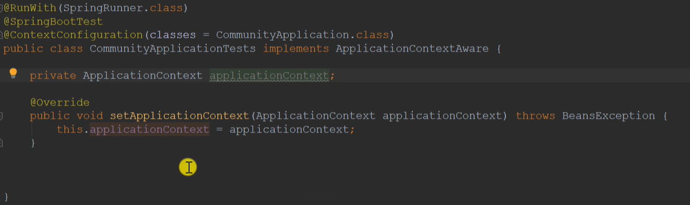
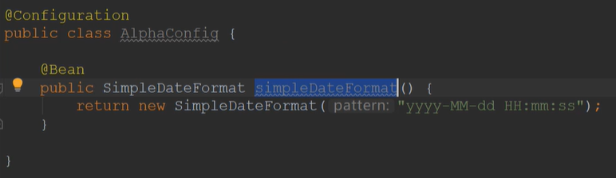
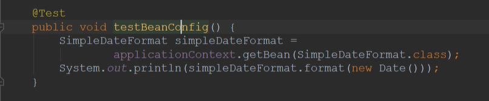

[TOC]

### 如何得到Spring容器

1. 想要得到Spring容器的类必须**继承ApplicationContextAware**(因为此类继承了BeanFactory)
2. **实现setApplicationContext方法**

### Spring相关注解

- **@PostContruct**（使用在方法上）：Spring容器在初始化之前会调用此方法
- **@PreDestory**（使用在方法上）：Spring容器会在此类销毁前调用
- **@Scope（“如下两种”）**
  - singleton：单例，Spring容器只会创建一个bean
  - prototype：多例，多创建多个不同的bean
- **@Qualifier("bean的名字")**：注入特定的bean

### 如何装配一个第三方的bean

可以先创建一个配置类，创建一个方法，在方法上面加上@Bean，这个方法的返回结果就放到容器里了（**bean的名字就是方法名**），就可以用了。如下图加载一个日期的方法

使用示例

