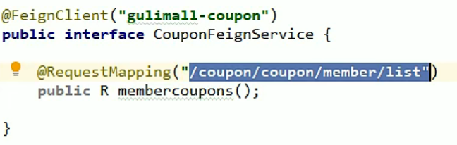
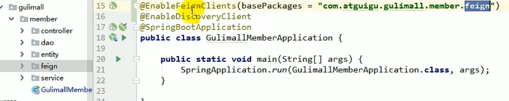

[TOC]

## 1、分布式组件

### 1、nacos注册中心使用步骤

1、修改pom文件，引入Nacos Discovery Starter

```xml
 <dependency>
     <groupId>com.alibaba.cloud</groupId>
     <artifactId>spring-cloud-starter-alibaba-nacos-discovery</artifactId>
 </dependency>
```

2、在应用的 /src/main/resources/application.properties 配置文件中配置 Nacos Server 地址

```yml
 spring.cloud.nacos.discovery.server-addr=127.0.0.1:8848
 还需要给模板设置名字
 appliction.name = gulimall-coupon
```

3、使用 @EnableDiscoveryClient 注解开启服务注册与发现功能

```java
 @SpringBootApplication
 @EnableDiscoveryClient
 public class ProviderApplication {

 	public static void main(String[] args) {
 		SpringApplication.run(ProviderApplication.class, args);
 	}

 	@RestController
 	class EchoController {
 		@GetMapping(value = "/echo/{string}")
 		public String echo(@PathVariable String string) {
 				return string;
 		}
 	}
 }
```

4、启动Nacos Server


### 2、feign使用步骤

1、引入open-feign依赖

2、编写一个接口，告诉SpringCloud这个接口需要调用远程服务，声明接口的每一个方法都是调用哪个远程服务的哪个请求-----**member可以使用membercoupons这个方法去调用/coupon'/coupon'/member/'list中对应的方法得到返回结果**



3、开启远程调用功能




### 3、nacos配置中心使用步骤

1、首先，修改 pom.xml 文件，引入 Nacos Config Starter。

```xml
 <dependency>
     <groupId>com.alibaba.cloud</groupId>
     <artifactId>spring-cloud-starter-alibaba-nacos-config</artifactId>
 </dependency>
```

2、在应用的 /src/main/resources/bootstrap.properties 配置文件中配置 Nacos Config 元数据

```xml
 spring.application.name=nacos-config-example
 spring.cloud.nacos.config.server-addr=127.0.0.1:8848
```

3、完成上述两步后，应用会从 Nacos Config 中获取相应的配置，并添加在 Spring Environment 的 PropertySources 中。这里我们使用 @Value 注解来将对应的配置注入到 SampleController 的 userName 和 age 字段，并添加 @RefreshScope 打开动态刷新功能

```java
 @RefreshScope
 class SampleController {

 	@Value("${user.nickname:zz}")
 	String userName;

 	@Value("${user.age:18}")
 	int age;
 }
```


## 2、Mybatis-plus

### 1、逻辑删除

第一步：配置application.yml

```yml
mybatis-plus:
  global-config:
    db-config:
      logic-delete-field: flag  # 全局逻辑删除的实体字段名(since 3.3.0,配置后可以忽略不配置步骤2)
      logic-delete-value: 1 # 逻辑已删除值(默认为 1)
      logic-not-delete-value: 0 # 逻辑未删除值(默认为 0)
```

第二步：实体类字段上加上`@TableLogic`注解

```java
@TableLogic
private Integer deleted;
```


### 2、分页功能

```java
//Spring boot方式
@Configuration
@EnableTransactionManagement
@MapperScan("com.atguigu.gulimall.product.dao")
public class MybatisPlusConfig {

    // 旧版
    @Bean
    public PaginationInterceptor paginationInterceptor() {
        PaginationInterceptor paginationInterceptor = new PaginationInterceptor();
        // 设置请求的页面大于最大页后操作， true调回到首页，false 继续请求  默认false
        paginationInterceptor.setOverflow(true);
        // 设置最大单页限制数量，默认 500 条，-1 不受限制
        paginationInterceptor.setLimit(1000);
        // 开启 count 的 join 优化,只针对部分 left join
        paginationInterceptor.setCountSqlParser(new JsqlParserCountOptimize(true));
        return paginationInterceptor;
    }
}
```


## 3、后台检验功能

### 1、JSR303数据校验

1. **javax.validation.constraints**的包里面提供了校验注解，在Bean里面的成员属性里面添加校验注解
2. controller中加校验注解**@Valid** ，public R save(@Valid @RequestBody BrandEntity brand){}
3. 给校验的Bean后，紧跟一个BindResult，就可以获取到校验的结果。拿到校验的结果，就可以自定义的封装。

```java
@RequestMapping("/save")
public R save(@Valid @RequestBody BrandEntity brand, BindingResult result){
    if( result.hasErrors()){
        Map<String,String> map=new HashMap<>();
        //1.获取错误的校验结果
        result.getFieldErrors().forEach((item)->{
            //获取发生错误时的message
            String message = item.getDefaultMessage();
            //获取发生错误的字段
            String field = item.getField();
            map.put(field,message);
        });
        return R.error(400,"提交的数据不合法").put("data",map);
    }else {

    }
    brandService.save(brand);

    return R.ok();
}

```

**用正则表达式来进行校验**

@Pattern（regexp = “正则表达式”，message = “提示错误信息”）


### 2、分组校验

- **给校验注解，标注上groups，指定什么情况下才需要进行校验 groups里面的内容要以接口的形式显示出来**

- **在Controller的类中使用@Validated注解来表示是哪个分组**

```java
	@NotNull(message = "修改必须指定品牌id",groups = {UpdateGroup.class})
	@Null(message = "新增不能指定id",groups = {AddGroup.class})
	@TableId
	private Long brandId;
	//UpdateGroup是自己定义的接口
------------------------------------------------------------------------------
    public R save(@Validated(AddGroup.class) @RequestBody BrandEntity brand){}
```


### 3、自定义校验功能

1. **编写自定义的检验注解**
2. **编写自定义的校验器**
3. **关联校验器和校验注解**

添加依赖

```xml
<dependency>
    <groupId>javax.validation</groupId>
    <artifactId>validation-api</artifactId>
    <version>2.0.1.Final</version>
</dependency>

```

1、编写自定义的检验注解

必须有三个属性

- message()  错误信息
- groups()   分组校验
- payload()   自定义负载信息

```java
@Documented
@Constraint(validatedBy = { ListValueConstraintValidator.class})
@Target({ METHOD, FIELD, ANNOTATION_TYPE, CONSTRUCTOR, PARAMETER, TYPE_USE })
@Retention(RUNTIME)
public @interface ListValue {
    // 使用该属性去Validation.properties中取
    String message() default "{com.atguigu.common.valid.ListValue.message}";

    Class<?>[] groups() default { };

    Class<? extends Payload>[] payload() default { };

    int[] value() default {};
}
```

message的属性值去哪里取呢？----------->创建ValidationMessages.properties

里面写上com.atguigu.common.valid.ListValue.message=必须提交指定的值 [0,1]


2、编写自定义的校验器

```java
public class ListValueConstraintValidator implements ConstraintValidator<ListValue,Integer> {
    private Set<Integer> set=new HashSet<>();
    @Override
    public void initialize(ListValue constraintAnnotation) {
        int[] value = constraintAnnotation.value();
        for (int i : value) {
            set.add(i);   //将Values可取的值传给set集合
        }

    }

    @Override
    public boolean isValid(Integer value, ConstraintValidatorContext context) {


        return  set.contains(value); //验证set集合中是否有传进来的值
    }
}

```


3、关校验器和校验注解-------一个检验注解可以关联多个校验器

```java
@Constraint(validatedBy = { ListValueConstraintValidator.class})
```


## 4、异常处理

### 1、统一异常处理

**使用SpringMVC提供的@ControllerAdvice注解，通过“basePackages”能够说明处理哪些路径下的异常**

@RestControllerAdvice   ==== @ControllerAdvice + @ReponseBody

```java
@Slf4j
@RestControllerAdvice(basePackages = "com.atguigu.gulimall.product.controller")
public class GulimallExceptionControllerAdvice {

    @ExceptionHandler(value = Exception.class) // 也可以返回ModelAndView
    public R handleValidException(MethodArgumentNotValidException exception){

        Map<String,String> map=new HashMap<>();
        // 获取数据校验的错误结果
        BindingResult bindingResult = exception.getBindingResult();
        bindingResult.getFieldErrors().forEach(fieldError -> {
            String message = fieldError.getDefaultMessage();
            String field = fieldError.getField();
            map.put(field,message);
        });

        log.error("数据校验出现问题{},异常类型{}",exception.getMessage(),exception.getClass());

        return R.error(400,"数据校验出现问题").put("data",map);
    }
}
```


## 5、注解

- **@JsonInclude(JsonInclude.Include.NON_EMPTY)**  :返回JSON时如果不为空就不携带
- **@TableField(exist = false)**  ：在bean里加入此注解表示数据库里面不存在这个字段
- **@EnableTransactionManagement**：事务注解


## 6、常用API

### 1、BeanUtils

```java
BeanUtils.copyProperties(source,target);   //复制属性
```


## 7、Jav函数编程-----要学
