[TOC]

# 1、ElasticSearch

## 1、基本概念

1. **Index（索引）**：名词：相当于MySQL的Database    动词：相当于MySQL中的insert
2. **Type（类型）**：相当于MySQL的表
3. **Document（文档）**：相当于MySQL中的Table里面的内容，**JSON**的形式存在
4. **倒排索引机制**：将整句拆分为单词，分别记录每个词在哪条记录中

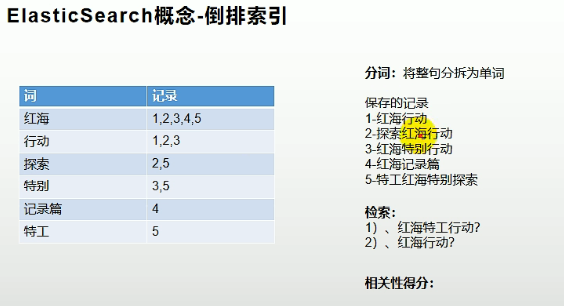

## 2、入门

### 1、_cat

- GET /_cat/nodes：查看所有节点
- GET /_cat/health：查看 es 健康状况
- GET /_cat/master：查看主节点
- GET /_cat/indices：查看所有索引      //  show databases; 

### 2、索引一个文档（保存）

- PUT请求：必须得指定id，不指定id会报错，已有此id执行更新操作
- POST请求：id不是必须指定，无此id会生成唯一id

**PUT**

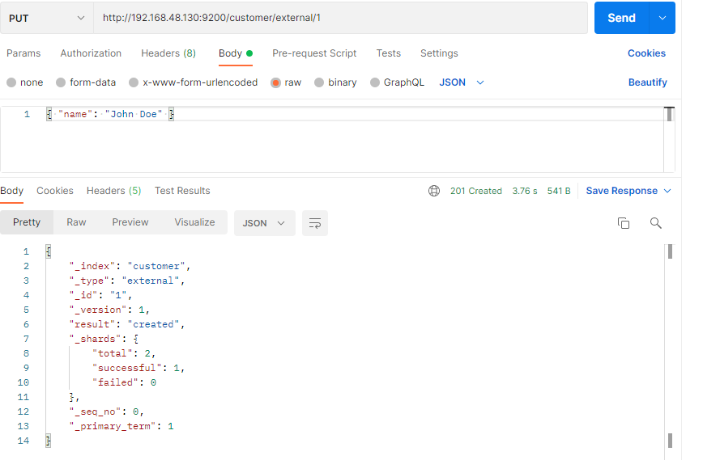

**POST**

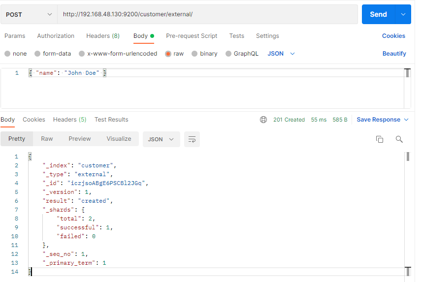

### 3、查询文档

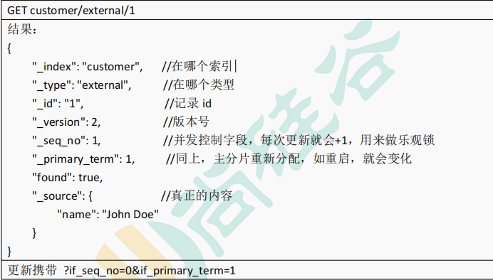

**version如果被更新一次就会加1**

### 4、更新文档

- 如果后面**带_update**，**则需要带上“doc”格式**，并且会检查原来的内容是否一样，如果一样则不更新version之类的都不变化
- 如果**没有带_update**,就不需要带“doc格式”，内容即使一样也会更新version之类的

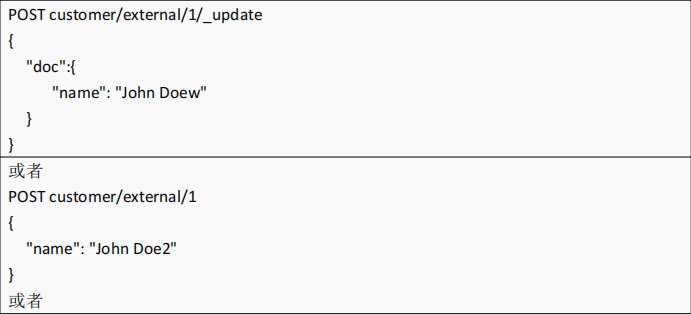

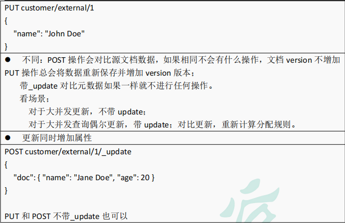

### 5、删除文档&索引

- **DELETE customer/external/1**
- **DELETE customer**

### 6、bulk批量API（批量操作）

- index相当于插入操作，可以替换成delete、create、update

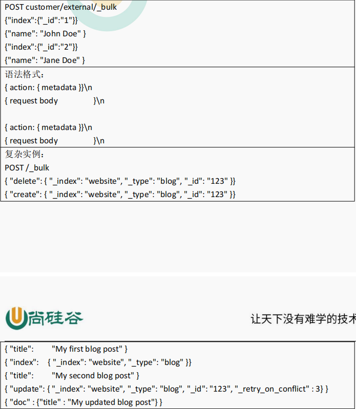

## 3、进阶

### 1、SearchAPI

两种基本检索方式

- 一种是使用 **REST request URI** 发送搜索参数（uri + 检索参数）
- 另一个是通过使用 REST request body 来发送它们（uri+请求体）

#### 1.1、检索信息------- _search

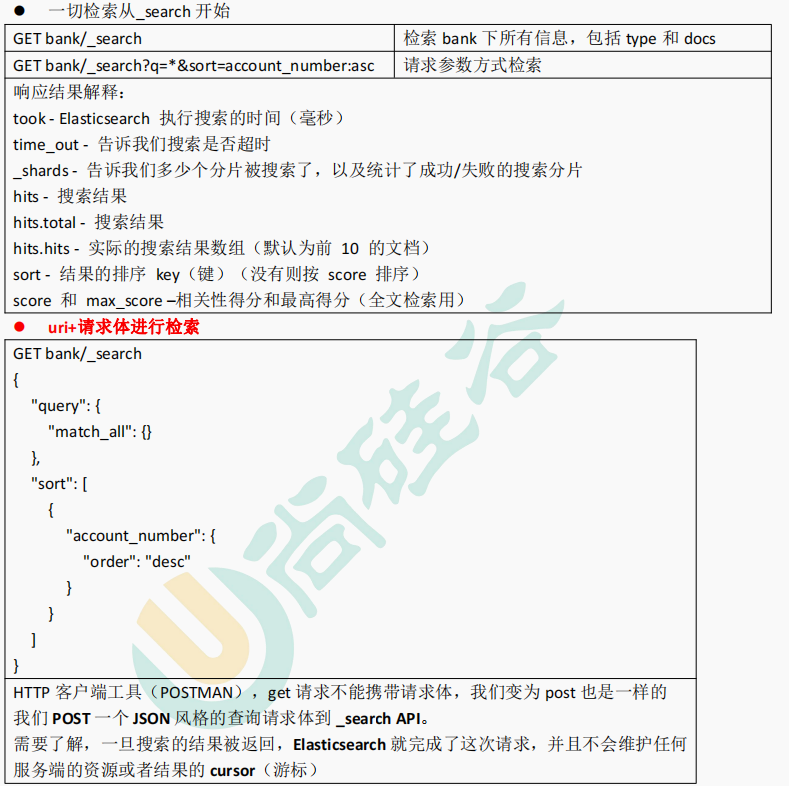

### 2、Query DSL

#### 2.1、基本语法格式

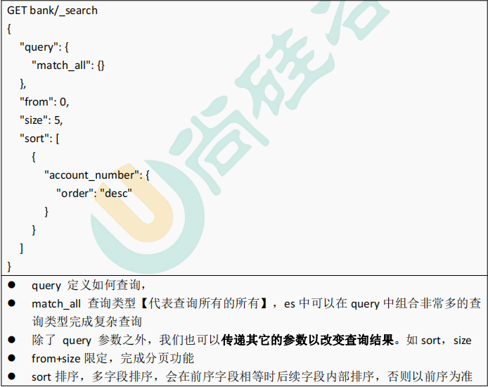

#### 2.2、返回部分字段

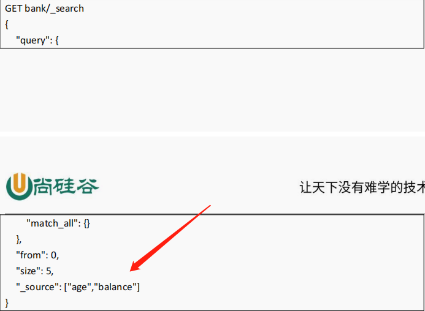

#### 3.3、match(匹配查询)

- **基本类型，精确匹配**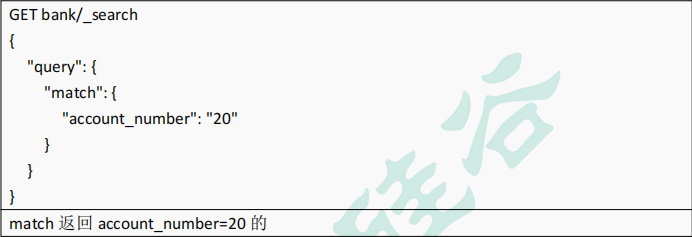
- **字符串，全文检索**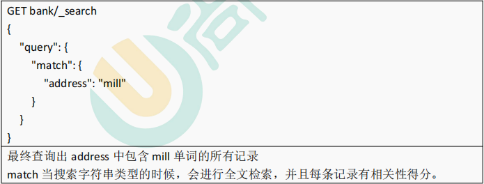
- **字符串，多个单词（分词+全文检索）**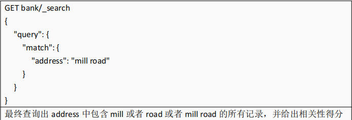

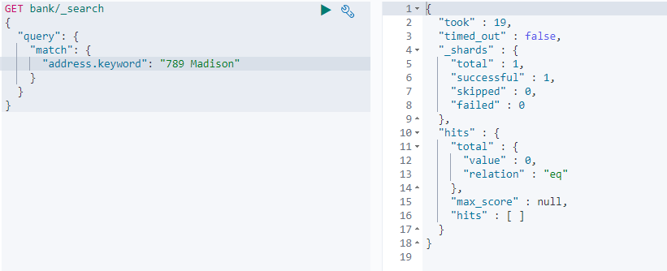

**当address后面加了keyword时，会将789 Madison当成一个完成的词去查询，不能多也不能少的查询，多一个或者少一个都匹配不到**

#### 3.4、match_phrase(短语匹配)

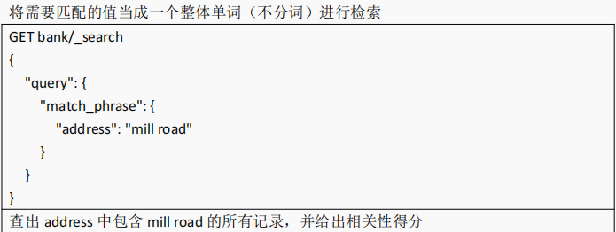

#### 3.5、multi_match (多字段匹配)

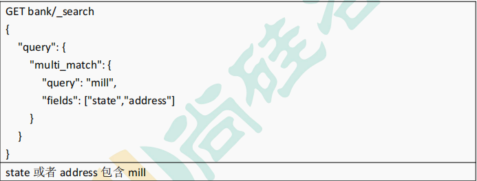

#### 3.6、bool(复合查询)

- **must**：必须达到 **must** **列举的所有条件**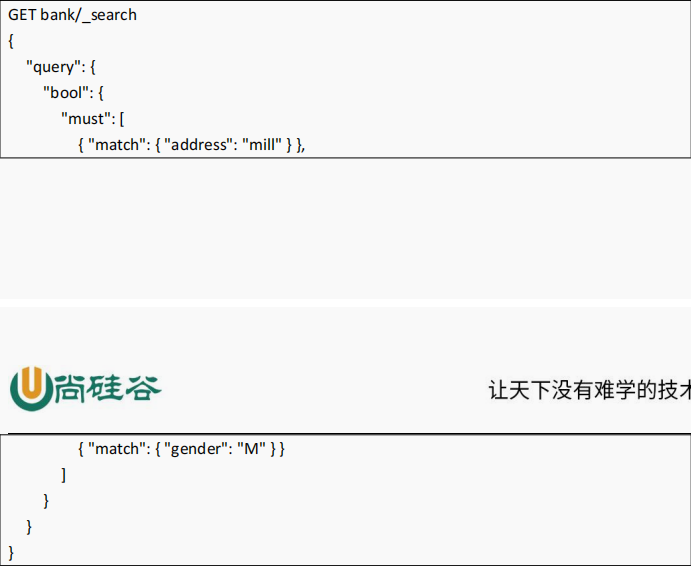
- **must_not** **必须不是指定的情况**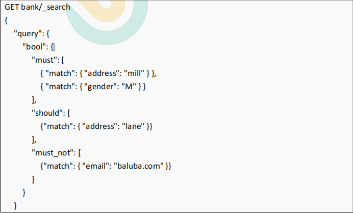
- **should**：应该达到 **should** **列举的条件，如果达到会增加相关文档的评分**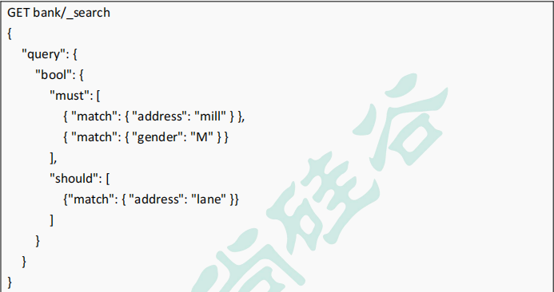

**三个条件可以一起组合查询**

#### 3.7、filter（结果过滤）

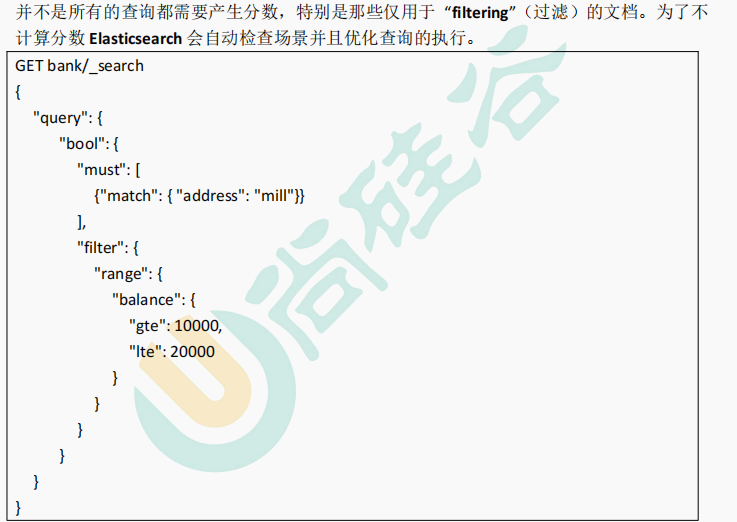

**Filter不计算分数**

#### 3.8、term

和 match 一样。匹配某个属性的值。**全文检索字段用** **match**，**其他非** **text** **字段匹配用** **term**。

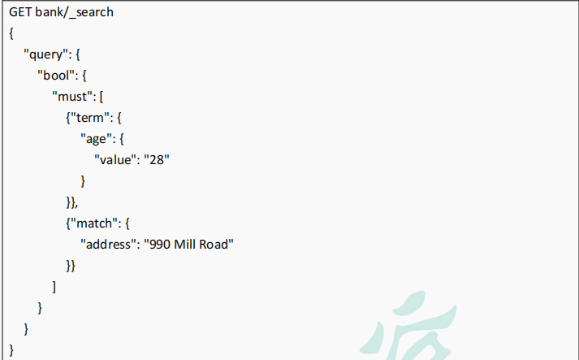

#### 3.9、aggregations（执行聚合）

- **搜索** **address** **中包含** **mill** **的所有人的年龄分布以及平均年龄，但不显示这些人的详情。**

  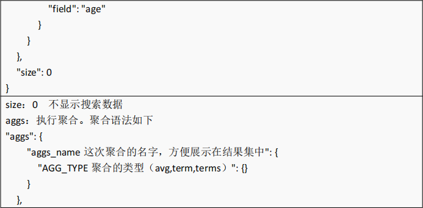

  - 按照年龄聚合，并且请求这些年龄段的这些人的平均薪资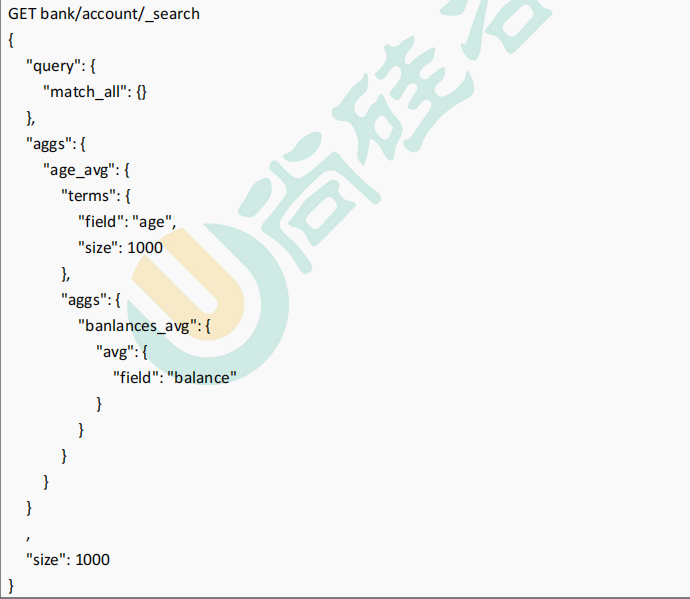

## 2、ElasticSearch整合Springboot

1. **导入依赖**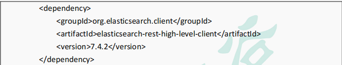
2. **编写配置类----将配置类返回结果放入Spring容器中**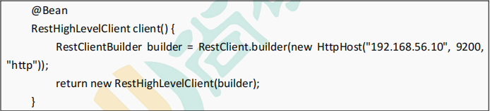
3. **使用**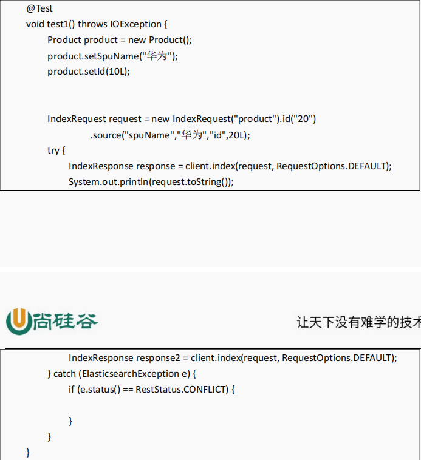

# 2、nginx

## 2.1、nginx搭建域名访问环境

P140、P141

# 3、压力测试

[E:\学习资料\Java学习资料\JAVA项目\尚硅谷谷粒商城电商项目\高级篇\课件\04、性能与压力测试.pdf]()

## 3.1、优化

- 数据库优化
- 模板的渲染速度
- 静态资源（nginx动静分离）
