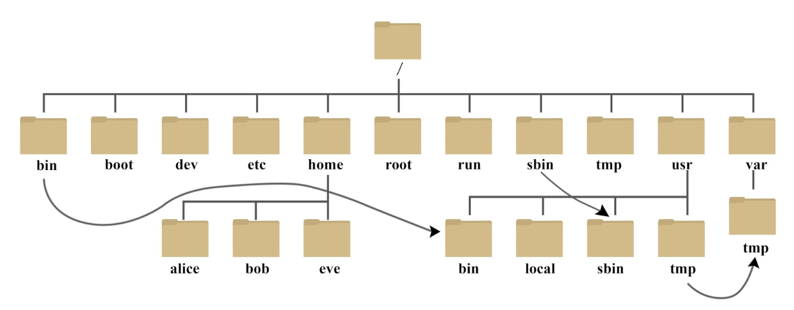
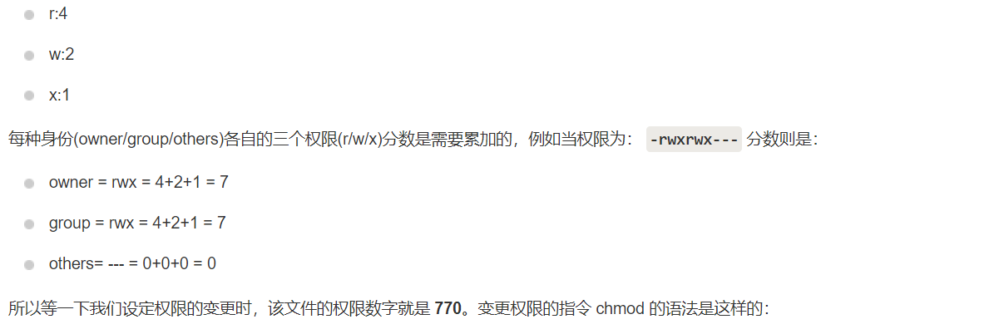

## 1、Linux系统目录结构



- **/bin**：Binaries二进制文件的缩写，存放着最经常使用的命令
- **/boot**：存放的是启动Linux时使用的一些核心文件，包括一些连接文件以及镜像文件
- **/dev**：Device（设备）的缩写，存放的是Linux的外部设备，在Linux中访问设备的方式和访问文件的方式是相同的
- **/etc**：Etcetera（等等）的缩写，存放所有的系统管理所需要的配置文件和子目录
- **/home**：用户的主目录，在Linux中，每个用户都有一个自己的目录，一般该目录名是以用户的账号命名的，如上图的alice、bob和eve
- **/lib**：Library（库）的缩写，存放着系统最基本的动态连接共享库，其作用Library类似于Windows 里的 DLL 文件。几乎所有的应用程序都需要用到这些共享库。
- **/root**：该目录为系统管理员，也称作超级权限者的用户主目录。
- **/usr**： usr 是 unix shared resources(共享资源) 的缩写，这是一个非常重要的目录，用户的很多应用程序和文件都放在这个目录下，类似于 windows 下的 program files 目录。
- **/usr/bin：**系统用户使用的应用程序。


## 2、Linux文件基本属性

Linux 系统是一种典型的多用户系统，不同的用户处于不同的地位，拥有不同的权限。

为了保护系统的安全性，Linux 系统对不同的用户访问同一文件（包括目录文件）的权限做了不同的规定。

在 Linux 中我们通常使用以下两个命令来修改文件或目录的所属用户与权限：

- **chown**（change owner）：修改所属用户与组
- **chmod**（change mode）：修改用户的权限

在 Linux 中我们可以使用 **ll** 或者 **ls –l** 命令来显示一个文件的属性以及文件所属的用户和组，如：

```shell
[root@www /]# ls -l
total 64
dr-xr-xr-x   2 root root 4096 Dec 14  2012 bin
dr-xr-xr-x   4 root root 4096 Apr 19  2012 boot
……
```

**第一个字符不同就代表类型不同**

- 当为 **d** 则是目录
- 当为 **-** 则是文件；
- 若是 **l** 则表示为链接文档(link file)；
- 若是 **b** 则表示为装置文件里面的可供储存的接口设备(可随机存取装置)；
- 若是 **c** 则表示为装置文件里面的串行端口设备，例如键盘、鼠标(一次性读取装置)。

**接下来的字符三个一组**

- **r**：可读
- **w**：可写
- **x**：可执行
- 1-3位是该**属主**(文件所有者)的权限，4-7是**属组**(同组用户)的权限，7-9是其他用户的权限

### 更改文件属性

- **chgrp**：更改文件属组 

  ```shell
  chgrp [-R] 属组名 文件名   //-R：会将该目录下的所有文件属组更改
  chgrp -v bin log2012.log
  ```

- **chown**：更改文件属主，也可以同时更改文件属组

  ```shell
  chown [-R] 属组名 文件名
  chown [-R] 属主名：属组名 文件名
  chown bin install.log
  chown root:root install.log
  ```

- **chmod**：更改文件的9个属性



```shell
chmod [-R] xyz 文件或目录
```

- **xyz** : 就是刚刚提到的数字类型的权限属性，为 **rwx** 属性数值的相加。

```shell
[root@www ~]# ls -al .bashrc
-rw-r--r--  1 root root 395 Jul  4 11:45 .bashrc
[root@www ~]# chmod 777 .bashrc
[root@www ~]# ls -al .bashrc
-rwxrwxrwx  1 root root 395 Jul  4 11:45 .bashrc
```


#### 参数说明

- **-c 或 --changes**：效果类似"-v"参数，但仅回报更改的部分。

- **-f 或 --quiet 或 --silent**： 　不显示错误信息。

- **-h 或 --no-dereference**： 　只对符号连接的文件作修改，而不改动其他任何相关文件。

- **-R 或 --recursive**： 　递归处理，将指定目录下的所有文件及子目录一并处理。

- **-v 或 --verbose**： 　显示指令执行过程。

- **--help**： 　在线帮助。

- **--reference=<参考文件或目录>**： 　把指定文件或目录的所属群组全部设成和参考文件或目录的所属群组相同。

  ```
  chgrp --reference=log2012.log log2013.log
  ```

- **--version**： 　显示版本信息。

