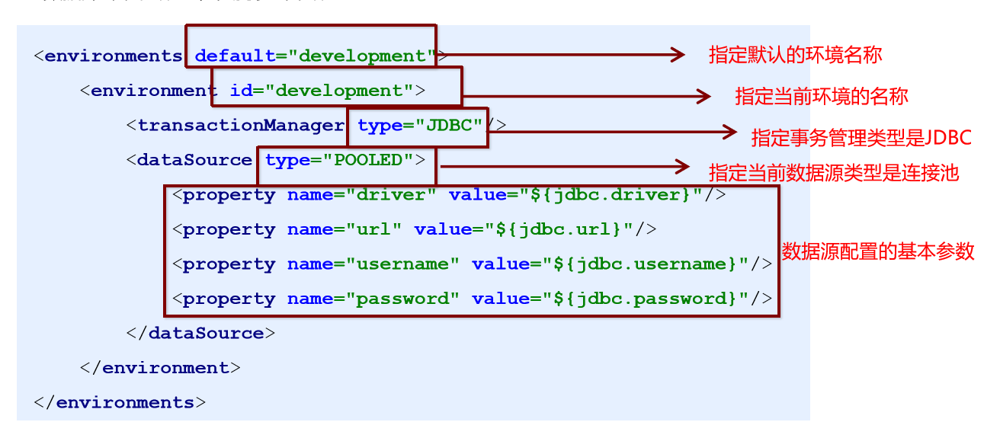
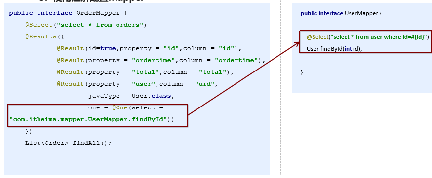

# MyBatis学习

[TOC]


## 1、原始jdbc操作

```java
//注册驱动
Class.forName("com.mysql.jdbc.Driver");
//获得连接
Connection connection = DriverManager.getConnection("jdbc:mysql://test","root","root");
//获得statement
PreparedStatement statement = connection.prepareStatement("select id, username, passwrd from user");
//执行查询
ResultSet resultSet = statement.executeQuery();
```


## 2、MyBatis快速入门

1. 添加MyBatis的坐标
2. 创建user数据表
3. 编写User实体类
4. 编写映射文件UserMapper.xml
5. 编写核心文件SqlMapConfig.xml
6. 编写测试类


## 3、MyBatis的映射文件概述


## 4、MyBatis核心配置文件概述

### MyBatis核心配置文件层级关系

- configuration 配置
  - properties 属性
  - settings 设置
  - typeAliases 类型别名
  - typeHandlers 类型处理器
  - objectFactory 对象工厂
  - plugins 插件
  - enviroments 环境
    - enviroment 环境变量
      - transactionManager 事务处理器
      - dataSource 数据源
  - databaseIdProvider 数据库厂商标识
  - mappers 映射器

### 1.enviroments标签




### 2.mapper标签

**作用：用来加载映射文件**

```java
<mapper resource = "com/itheima/mapper/UserMapper.xml"></mapper>
```


### 3.properties标签

**作用：用来加载properties文件**

```java
<properties resource="jdbc.properties"></properties>
```


### 4.typeAliases标签

```java
<typeAliases>
  <typeAlias type = "com.itheima.domain.User" alias = "user"></typeAlias>
</typeAliases>
```


## 5、Mybatis的Dao层实现

**代理开发方式**：只需要写Dao层的接口就行，不需要写具体的实现


测试：


## 6、MyBatis映射文件深入

- **动态SQL之`<if>`**

```xml
<select id = "findByCondition" parameterType = "user" resultType = "user">
    select * from User
    <where>
        <if test = "id != 0">
            and id = #{id}
        </if>
    </where>
</select>
```


- **动态SQL之`<foreach>`**

```xml
<select id = "findByIds" parameterType = "list" resultType = "user">
    select * from User
    <where>
        <foreach collection = "array" open = "id in(" close = ")" item = "id" separator= ",">
            #{id}
        </foreach>
    </where>
</select>
```


- **SQL片段抽取**

```xml
<sql id = "selectUser" >select * from User</sql>
<select id = "findById" parameterType = "int" resultType = "user">
    <include refid = "selectUser"></include>
</select>
```


## 7、MyBatis核心配置文件深入

### typeHandlers标签

- 无论是MyBatis在预处理语句(PreparedStatement)中设置一个参数时，还是从结果集中取出一个值时，都会用类型处理器将获取的值以合适的方式转换成Java类型

| 类处理器           | Java类型                    | JDBC类型                            |
| ------------------ | --------------------------- | ----------------------------------- |
| BooleanTypeHandler | java.lang.Boolean , boolean | 数据库兼容的BOOLEAN                 |
| ByteTypeHandler    | java.lang.Byte , byte       | 数据库兼容的NUMERIC或BYTE           |
| ShortTypeHandler   | java.lang.Short , short     | 数据库兼容的NUMERIC或SHORT INTEGER  |
| IntegerTypeHandler | java.lang.Integer , int     | 数据库兼容的NUMERIC 或 INTEGER      |
| LongTypeHandler    | java.lang.Long , long       | 数据库兼容的NUMERIC 或 LONG INTEGER |


**开发步骤**

1. 定义转换类继承类BaseTypeHandler<T>
2. 覆盖4个未定义的方法，其中setNonNullParameter为java程序设置数据到数据库的回调方法，getNullableResult为查询是mysql的字符串类型转换成java的Type类型的方法
3. 在MyBatis核心配置文件中进行注册
4. 测试转换是否正确


### plugins标签：分页标签

开发步骤：

1. 导入通用PageHelper的坐标
2. 在mubatis核心配置文件中配置PageHelper插件
3. 测试分页数据获取

**配置PageHelper插件**

```xml
<!-- 配置要在mapper之前-->
<plugin interceptor = "com.github.pagehelper.PageHelper">
    <!--指定方言 -->
    <preperty name  = "dialect" value = "mysql"/>
</plugin>
```

测试代码要加上

```java
PageHelper.startPage(1,2);
```

**分页其他相关参数**

```java
PageInfo<User> pageInfo = new PageInfo<User>(select);
//都在pageInfo里面
```


## 8、MyBatis多表查询

**一对一查询配置**

```xml
<mapper namespace = "com.itheima.mapper.OrderMapper">
    <resultMap id = "orderMap" type = "com.itheima.domain.Order">
        <result column = "uid" property = "user.id"></result>
        <result column = "username" property = "user.username"></result>
        <result column = "password" property = "user.passwprd"></result>
        <result column = "birthday" property = "user.birthday"></result>
    </resultMap>
    <select id = "findAll" resultMap = "orderMap">
        select * from orders o , user u where o.uid = u.id
    </select>
</mapper>
```


**一对多查询配置**

```xml
<mapper namespace = "com.itheima.mapper.OrderMapper">
    <resultMap id = "orderMap" type = "com.itheima.domain.Order">
        <result column = "uid" property = "user.id"></result>
        <result column = "username" property = "user.username"></result>
        <result column = "password" property = "user.passwprd"></result>
        <result column = "birthday" property = "user.birthday"></result>
        <!--orderList是在order里面定义的链表-->
        <collection property = "orderList" ofType = "com.itheima.domain.Order">
            <result column = "oid" property = "id"> </result>
            <result column = "ordertime" property = "ordertime"></result>
            <result column = "total" property = "total"> </result>
        </collection>
    </resultMap>
    <select id = "findAll" resultMap = "orderMap">
        select * from orders o , user u where o.uid = u.id
    </select>
</mapper>
```


## 9、MyBatis注解开发

**常用的注解开发**

- @Insert : 实现新增
- @Update ：实现更新
- @Delete：实现删除
- @Select：实现查询
- **@Result**：实现结果集封装
- **@Results**：可以与@Result一起使用，封装多个结果集
- **@One**：实现一对一结果集封装
- **@Many**：实现一对多结果集封装


| 注解            | 说明                                                         |
| --------------- | ------------------------------------------------------------ |
| @Results        | 代替的是标签`<resultMap>`,该注解中可以使用单个@Result注解，也可以使用@Result集合。使用格式：@Results({@Result(), @Result() }) 或 @Results( @Result () ) |
| @Result         | 替代了`<id>`标签和`<result>`标签  <br /> @Result中属性介绍：<br /> column：数据库的列名<br />property：需要装配的属性名<br />one：需要使用的@One注解 （@Result （one = @One）（））<br />many：需要使用的@Many注解（@Result （many=@many）（）） |
| @One（一对一）  | 代替了`<assocation>`标签，是多表查询的关键，在注解中用来指定子查询返回单一对象<br />@One注解属性介绍：<br />select 指定用来多表查询的sqlmapper<br />使用格式：@Result（column = ‘ ’ ，property = ' '，one = @One（select =" "）） |
| @Many（多对一） | 替代了`<collection>`标签，是多表查询的关键，在注解中用来指定子查询返回对象集合<br />@Result（property = “ ”，column = " ", many = @Many (select = " ")） |





