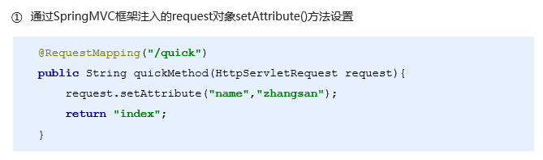

[TOC]

# SpringMVC学习笔记

## 1、Spring集成web环境

### ApplicationContext应用上下文获取方式

应用上下文对象是通过new ClasspathXmlApplicationContext(spring配置文件)方式获取的，但是每次从容器中获得Bean时都要编写new ClasspathXmlApplicationContext(spring配置文件)，这样的弊端是配置文件加载多次，应用上下文对象创建多次。

在web项目中，可以使用ServletContextListener监听web应用的启动，我们可以在web应用启动时，就加载Spring的配置文件，创建应用上下文对象ApplicationContext，在将其储存到最大的域servletContext域中，这样就可以在任意位置从域中获得应用上下文ApplicationContext对象。

- 在web.xml中配置ContextLoaderListener监听器（导入spring-web坐标）
- 使用WebApplicationContextUttils获得应用上下文对象ApllicationConetxt

## 2、SpringMVC概述

SpringMVC是一种基于Java的实现MVC设计模型的请求驱动类型的轻量级Web框架，属于SpringFrameWork的后续产品。

### 快速入门

1. 导入SpringMVC相关坐标
2. 配置SpringMVC核心控制器DispatherServlet   **在哪里配？** 在web.xml中配置
3. 创建Controller类和视图页面
4. 使用注解配置Controller类中业务方法的映射地址
5. 配置SpringMVC核心文件spring-mvc.xml  **里面需要配什么？**配组件扫描
6. 客户端发起请求测试

## 3、SpringMVC组件和注解解析

### 执行流程

### 视图解析器

## 4、SpringMVC的请求和响应

### SpringMVC的数据响应方式

1. 页面跳转
   - 直接返回字符串
   - 通过ModelAndView对象返回
2. 回写数据
   - 直接返回字符串
   - 返回对象或集合

#### 页面跳转

- 返回字符串

- 返回ModelAndView对象

- 向request域储存数据

#### 回写数据

- 直接返回字符串

- 返回对象或集合

### Spring获得请求数据

SpringMVC可以接收的类型

- 基本类型参数
- POJO类型参数
- 数组类型参数
- 集合类型参数

#### 获得基本类型参数

Controller中的业务方法的参数名称要与请求参数的name一致，参数值会自动映射匹配

#### 获得POJO类型参数

Controller中的业务方法的POJO参数的属性名与请求参数的name一致，参数值会自动映射匹配

#### 获得数组类型参数

Controller的业务方法数组名称与请求参数的name一致，参数值会自动映射匹配

#### 获得集合类型参数

获得集合参数时，要将集合参数包装到一个POJO中才可以

### 请求乱码问题

## 5、SpringMVC拦截器

详情见第七天ppt