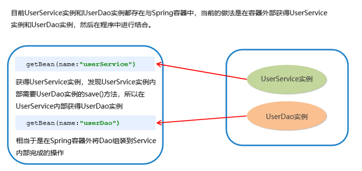
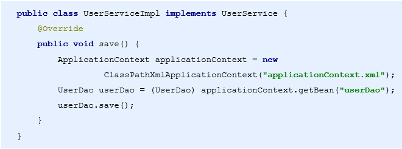

[TOC]


## 1、Spring 程序开发步骤

1. 导入Spring开发的基本包坐标

2. 编写Dao接口和实现类

3. 创建Spring核心配置文件

4. 在Spring配置文件中配置UserDaoImpl

5. 使用Spring的API获得Bean实例

   

```xml
<!-- 4的实例 -->
<bean id = "userDao" class = "com.itheima.dao.impl.UserDaoImpl"></bean>
```


```java
// 5的实例

public void test（） {
    ApplicationContext applicationContext = new ClassPathXmlApplicationContext("applicationContext.xml");
    UserDao userDao = (UserDao)applicationContext.getBean("userDao");
    //userDao就是通过Spring获得的实例
}

```


## 2、Spring配置文件

### Bean标签

- **id**：Bean实例在Spring容器中的唯一标识
- **class**：Bean的全限定名称
- **scope**：指对象的作用范围
  - **singleton**：默认值，单例的
  - prototype：多例的
- **生命周期配置**
  - **init-method**：指定类中的初始化方法名称
  - **destory-method**：指定类中销毁方法名称


### Bean实例化的三种方式

1. 无参构造方法实例化
2. 工厂静态方法实例化
3. 工厂实例方法实例化

1：


2：


3：


### Spring的依赖注入

分析：



解决方法：


**依赖注入**：简单的说，就是等框架把持久层对象传入业务层，而不用我们自己去获取


#### Bean的依赖注入方式

- 构造方法
- set方法


**set方法注入**

```java
private UserDao userDao;
public void set UserDao(UserDao userDao) {
    this.userDao = userDao;
}
```

还需要配置文件中添加

```xml
<bean id = "userDao" class = "com.itheima.dao.impl.UserDaoImpl"/>

<bean id = "userService" class = "com.itheima.service.impl.UserServiceImpl">
    <property name = "userDao" ref = "userDao"/>
</bean>
```


**构造方法注入**

   创建UserDao有参构造方法



配置文件写法：


#### Spring依赖注入的数据类型

- 普通数据类型
- 引用数据类型
- 集合数据类型


**普通类型的注入**

```xml
<bean id = "userDao" class = "com.itheima.dao.impl.UserDaoImpl">
    <property name = "company" value = "传智播客"></property>
    <property name = "age" value = "12"></property>
</bean>
```


**集合类型的注入**

```xml
<bean id = "userDao" class = "com.itheima.dao.impl.UserDaoImpl">
    <property name = "strList">
        <list>
            <value>aaa</value>
            <value>bbb</value>
            <value>ccc</value>
        </list>
    </property>
</bean>
```


**集合数据类型（List<User>）的注入**

```xml
<bean id = "u1" calss = "com.itheima.domain.User"/>
<bean id = "u2" class = "com.itheima.domain.User"/>
<bean id = "userDao" class = "com.itheima.dao.impl.UserDaoImpl">
    <property name = "userList">
        <list>
            <bean class = "com.itheima.domain.User"/>
            <bean calss = "com.itheima.domain.User"/>
            <ref bean = "u1"/>
            <ref bean = "u2"/>
        </list>
    </property>
</bean>
```


集合数据类型（Map<String,User>）的注入

```xml
<bean id = "u1" calss = "com.itheima.domain.User"/>
<bean id = "u2" class = "com.itheima.domain.User"/>
<bean id = "userDao" class = "com.itheima.dao.impl.UserDaoImpl">
    <property name = "userMap">
        <map>
            <entry key = "user1" value-ref = "u1"/>
            <entry key = "user2" value-ref = "u2"/>
        </map>
    </property>
</bean>
```


集合数据类型（Properties）的注入

```xml
<bean id = "userDao" class = "com.itheima.dao.impl.UserDaoImpl">
    <property name = "properties">
        <props>
            <prop key = "p1">aaa</prop>
            <prop key = "p2">bbb</prop>
            <prop key = "p3">ccc</prop>
        </props>
    </property>
</bean>
```


### Spring配置数据源

#### 数据源的作用

- 数据源（连接池）是提高程序性能出现的
- 事先实例化数据源，初始化部分连接资源
- 使用连接资源是从数据源中获取
- 使用完毕后将连接资源归还给数据源

常见的数据源（连接池）：DBCP、C3PO、BoneCP、Druid等


**开发步骤**

1. 导入数据源的坐标和数据库驱动坐标
2. 创建数据源对象
3. 设置数据源的基本连接数据
4. 使用数据源获取连接资源和归还连接资源


### Spring注解开发

| 注解           | 说明                                                  |
| -------------- | ----------------------------------------------------- |
| @Component     | 使用在类上用于实例化Bean                              |
| @Controller    | 使用在web层类上实例化Bean                             |
| @Service       | 使用在service层类上用于实例化Bean                     |
| @Repository    | 使用在dao层类上用于实例化Bean                         |
| @Autowired     | 使用在字段上用于根据类型依赖注入    ？不懂            |
| @Qualifier     | 结合@Autowired一起使用用于根据名称进行依赖注入 ？不懂 |
| @Resource      | 相当于@Autowired+@Qualifier，按照名称进行注入 ？不懂  |
| @Value         | 注入普通属性                                          |
| @Scope         | 标注Bean的作用范围                                    |
| @PostConstruct | 使用在方法上标注该方法是Bean的初始化方法              |
| @PreDestroy    | 使用在方法上标注该方法是Bean的销毁方法                |


**进行注解开发时需要先配置组件扫描**

```xml
<context:component-scan base-package = "com.itheima"></context:component-scan>
```


#### Spring新注解

- 非自定义的Bean的配置：**< bean >**
- 加载properties文件的配置：**< context:property-placeholder >**
- 组件扫描的配置：**< context:component-scan >**
- 引入其他文件：**< import >**


| 注解            | 说明                                                         |
| --------------- | ------------------------------------------------------------ |
| @Configuration  | 用于指定当前类是一个Spring配置类，当创建容器时会从该类上加载注解 |
| @ComponentScan  | 用于指定Spring在初始化容器时要扫描的包<br />作用和在Spring的xml配置文件中的<br />< context:component-scan base-package = "com.itheima"/> 一样 |
| @Bean           | 使用在方法上，标注将该方法的返回值储存到Spring容器中         |
| @PropertySource | 用于加载properties文件中的配置                               |
| @Import         | 用于导入其他配置类                                           |

