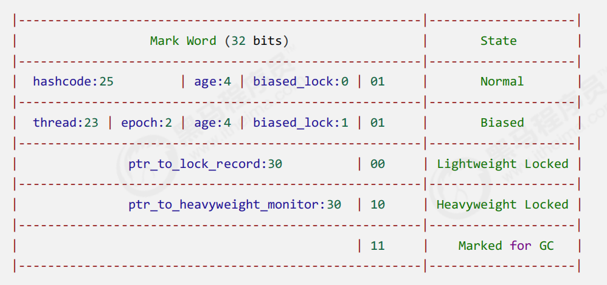
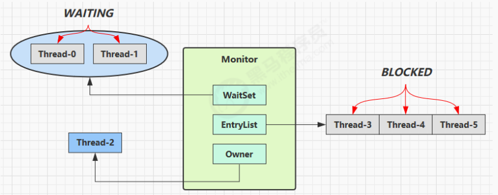
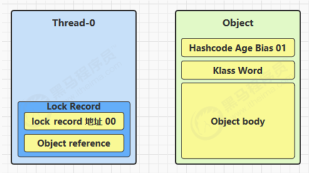
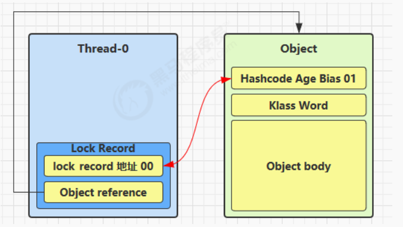
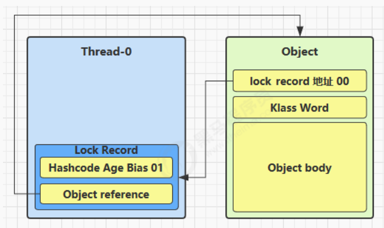
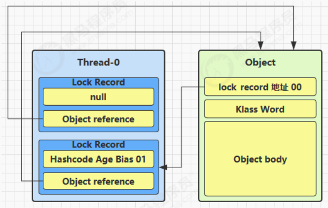
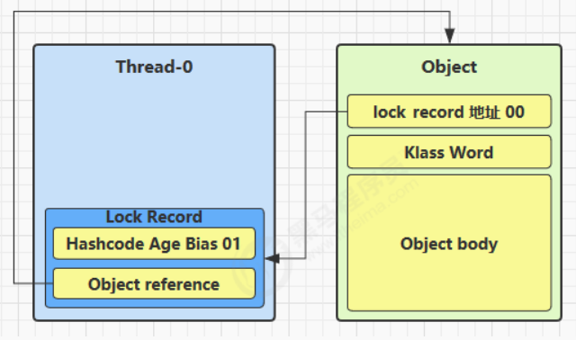
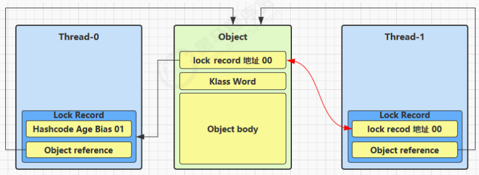
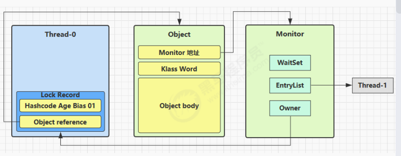

### 共享问题

两个线程对初始值为 0 的静态变量一个做自增，一个做自减，各做 5000 次，结果是 0 吗？

```java
static int counter = 0;
public static void main(String[] args) throws InterruptedException {
 Thread t1 = new Thread(() -> {
 for (int i = 0; i < 5000; i++) {
	 counter++;
 }
 }, "t1");
 Thread t2 = new Thread(() -> {
 for (int i = 0; i < 5000; i++) {
 counter--;
 }
 }, "t2");
 t1.start();
 t2.start();
 t1.join();
 t2.join();
 log.debug("{}",counter);
}
```

以上的结果可能是正数、负数、零。为什么呢？因为 **Java 中对静态变量的自增，自减并不是原子操作**


### 临界区

- 一个程序运行多个线程本身是没有问题的
- 问题出在多个线程访问**共享资源**
  - 多个线程读**共享资源**其实也没有问题
  - 在多个线程对**共享资源**读写操作时发生指令交错，就会出现问题
- 一段代码块内如果存在对**共享资源**的多线程读写操作，称这段代码块为**临界区**

例如，下面代码中的临界区

```java
static int counter = 0;
static void increment() 
// 临界区
{ 
 counter++; }
static void decrement() 
// 临界区
{ 
 counter--; }
```


### **竞态条件**

多个线程在临界区内执行，由于代码的**执行序列不同**而导致结果无法预测，称之为发生了**竞态条件**


### synchronized解决方案

为了避免临界区的竞态条件发生，有多种手段可以达到目的。

- 阻塞式的解决方案：synchronized，Lock
- 非阻塞式的解决方案：原子变量

synchronized，来解决上述问题，即俗称的【对象锁】，它采用互斥的方式让同一时刻至多只有一个线程能持有【对象锁】，其它线程再想获取这个【对象锁】时就会阻塞住。这样就能保证拥有锁的线程可以安全的执行临界区内的代码，不用担心线程上下文切换


####  java 中互斥和同步都可以采用 synchronized 关键字来完成，但它们还是有区别的：

- 互斥是保证临界区的竞态条件发生，同一时刻只能有一个线程执行临界区代码
- 同步是由于线程执行的先后、顺序不同、需要一个线程等待其它线程运行到某个点


**synchronized**

语法

```java
synchronized(对象) // 线程1， 线程2(blocked)
{
 临界区
}
```

synchronized 实际是用**对象锁**保证了**临界区内代码的原子性**，临界区内的代码对外是不可分割的，不会被线程切换所打断。


方法上的synchronized	

```java
class Test{
 public synchronized void test() {
 
			 }
		}
等价于
class Test{
	 public void test() {
		 synchronized(this) {
 
				 }
		 }
}
```

```java
class Test{
 public synchronized static void test() {
			 }
		}
等价于
class Test{
 public static void test() {
		 synchronized(Test.class) {
 
 			}
		 }
}
```


### 变量的线程安全分析

#### 成员变量和**静态变量是否线程安全？**

- 如果它们没有共享，则线程安全
- 如果它们被共享了，根据它们的状态是否能够改变，又分两种情况
  - 如果只有读操作，则线程安全
  - 如果有读写操作，则这段代码是临界区，需要考虑线程安全

#### **局部变量是否线程安全？**

- 局部变量是线程安全的
- 但局部变量引用的对象则未必
  - 如果该对象没有逃离方法的作用访问，它是线程安全的
  - 如果该对象逃离方法的作用范围，需要考虑线程安全

#### 常见线程安全类

- String
- Integer
- StringBuffer
- Random
- Vector
- Hashtable
- java.util.concurrent


### Monitor概念

Java对象头

以32位虚拟机为例


其中Mark Word结构为




#### Monitor原理

Monitor被翻译为**监视器**或**管程**

每个Java对象都可以关联一个Monitor对象，如果使用synchronized给对象上锁（重量级）之后，该对象头的Mark Word就被设置指向Monitor对象的指针

Monitor结构如下



- 刚开始Monitor中的Owner为null

- 当Thread-2执行synchronized(obj)就会将Owner置位Thread-2，Monitor中只能有一个Owner

- 在Thread-2上锁的过程中，如果Thread-3，Thread-4，Thread-5也来执行synchronized（obj），就会进入EntryList  BLOCKED

- Thread-2执行完同步代码块的内容，然后唤醒EntryList中等待的线程来竞争锁，竞争的时候是非公平的

- 图中 WaitSet 中的 Thread-0，Thread-1 是之前获得过锁，但条件不满足进入 WAITING 状态的线程，后面讲

  wait-notify 时会分析

注意

- synchronized 必须是进入同一个对象的 monitor 才有上述的效果
- 不加 synchronized 的对象不会关联监视器，不遵从以上规则


### synchronized原理

#### 1.轻量级锁

轻量级锁的使用场景：如果一个对象虽然有多线程要加锁，但加锁的时间是错开的（也就是没有竞争），那么可以使用轻量级锁来优化。轻量级锁对使用者是透明的，即语法仍然是 synchronized

假设有两个方法同步块，利用同一个对象加锁

```java
static final Object obj = new Object();
public static void method1() {
 	synchronized( obj ) {
 // 同步块 A
 method2();
 	}
}
public static void method2() {
 	synchronized( obj ) {
 // 同步块 B
 	}
}
```

- 创建锁记录（Lock Record）对象，每个线程都的栈帧都会包含一个锁记录的结构，内部可以存储锁定对象的Mark Word



- 让锁记录中 Object reference 指向锁对象，并尝试用 cas 替换 Object 的 Mark Word，将 Mark Word 的值存入锁记录



- 如果 cas 替换成功，对象头中存储了 锁记录地址和状态 00 ，表示由该线程给对象加锁，这时图示如下



- 如果 cas 失败，有两种情况
  - 如果是其它线程已经持有了该 Object 的轻量级锁，这时表明有竞争，进入锁膨胀过程
  - 如果是自己执行了 synchronized 锁重入，那么再添加一条 Lock Record 作为重入的计数



- 当退出 synchronized 代码块（解锁时）如果有取值为 null 的锁记录，表示有重入，这时重置锁记录，表示重入计数减一



- 当退出 synchronized 代码块（解锁时）锁记录的值不为 null，这时使用 cas 将 Mark Word 的值恢复给对象头
  - 成功，则解锁成功
  - 失败，说明轻量级锁进行了锁膨胀或已经升级为重量级锁，进入重量级锁解锁流程

#### 2.锁膨胀

如果在尝试加轻量级锁的过程中，CAS 操作无法成功，这时一种情况就是有其它线程为此对象加上了轻量级锁（有竞争），这时需要进行锁膨胀，将轻量级锁变为重量级锁。

- 当 Thread-1 进行轻量级加锁时，Thread-0 已经对该对象加了轻量级锁



- 这时 Thread-1 加轻量级锁失败，进入锁膨胀流程
  - 即为 Object 对象申请 Monitor 锁，让 Object 指向重量级锁地址
  - 然后自己进入 Monitor 的 EntryList BLOCKED



- 当 Thread-0 退出同步块解锁时，使用 cas 将 Mark Word 的值恢复给对象头，失败。这时会进入重量级解锁流程，即按照 Monitor 地址找到 Monitor 对象，设置 Owner 为 null，唤醒 EntryList 中 BLOCKED 线程

#### 3.自旋优化

重量级锁竞争的时候，还可以使用自旋来进行优化，如果当前线程自旋成功（即这时候持锁线程已经退出了同步块，释放了锁），这时当前线程就可以避免阻塞。

#### 4.偏向锁

轻量级锁在没有竞争时（就自己这个线程），每次重入仍然需要执行 CAS 操作。

Java 6 中引入了偏向锁来做进一步优化：只有第一次使用 CAS 将线程 ID 设置到对象的 Mark Word 头，之后发现这个线程 ID 是自己的就表示没有竞争，不用重新 CAS。以后只要不发生竞争，这个对象就归该线程所有
