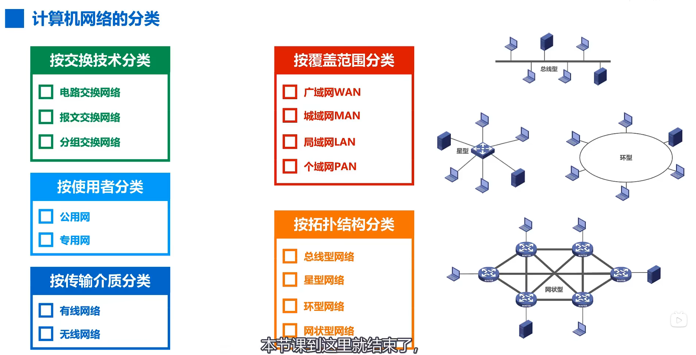

[TOC]

## 因特网概述

### 1、网络、互联网、因特网

- 网络：由若干个结点个连接这些结点的链路组成
- 互联网：多个网络还可以通过路由器互连起来，构成更大的网络，即互联网
- 因特网：最大的互联网

### 2、因特网的组成

- 边缘部分：由所有连接在因特网的**主机**组成，这部分是**用户直接使用**的，用来进行**通信**（传送数据、音频或视频）和**资源共享**
- 核心部分：由**大量网络**和连接这些网络的**路由器**组成，这部分是**为边缘部分提供服务**的（提供连通性和交换）

### 3、电路交换、分组交换、报文交换

#### 电路交换

#### 分组交换

#### 三者对比

### 4、计算机网络的分类

### 5、计算机网络的性能指标

#### 速率

#### 带宽

#### 吞吐量

#### 时延

#### 时延带宽积、往返时间、利用率、丢包率

### 6、计算机网络体系结构

### 7、计算机网络结构分层的必要性

