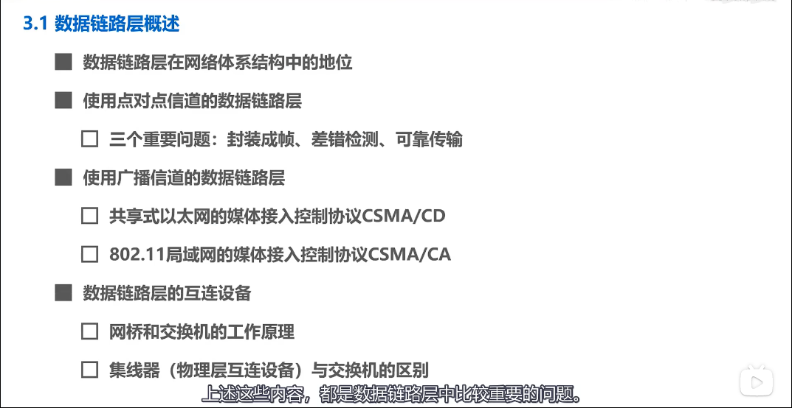

[TOC]

## 数据链路层

### 1、数据链路层概述

### 2、封装成帧

- 封装成帧是指数据链路层给上层交付的协议数据单元添加帧头和帧尾使之成为帧
  - 帧头和帧尾包含有重要的控制信息
  - 帧头和帧尾的作用之一就是**帧定界**
  - 若数据单元中有与帧定界一样的字符时，需使用**转义字符**来区分
- 透明传输是指**数据链路层对上层交付的传输数据没有任何限制**，就好像数据链路层不存在一样
  - 面向字节的物理链路使用字节填充的方法实现透明传输
  - 面向比特的物理链路使用比特填充的方法实现透明传输

### 3、差错检测

- 奇偶校验
  - 在待发送的数据后面添加1位奇偶校验位，是整个数据中“1”的个数为奇数
- 循环冗余校验CRC

### 4、可靠传输

